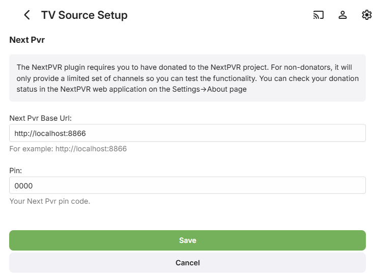

Emby Live TV supports setting up NextPVR as a TV Tuner source. Once you have NextPVR setup and ready to use it's very simply to add to Emby. You do not need to setup guide data in NextPVR as we will set this up in Emby.

Click the Live TV menu option from the web admin and you will see a screen similar to this.


Click the + sign next to TV Sources and you will get the following screen:


Select the M3U Tuner option from above then setup NextPVR similar to this:



Set the number of streams your provider gives you in the last box.
You will need to change the IP & Port in the URL to math your system.
NextPVR uses the following format: 

`http://IP:PORT/service?method=channel.m3u`

### If not using Emby Server Version 4.7+

You will need to change each URL line (search and replace) to include a unique tag.  I suggest using the channel number.  So you add &client=1 to the end of each URL.  Change 1 to match the channel number.  This is handled by Emby Server automatically in versions 4.7 and higher!

```M3U
#EXTM3U
#EXTINF:-1 tvg-chno="1",Channel Name for 1
http://IP:PORT/live?channel=1&client=1
#EXTINF:-1 tvg-chno="2",Channel Name for 2
http://IP:PORT/live?channel=2&client=2
#EXTINF:-1 tvg-chno="3",Your Channel Name for 3
http://IP:PORT/live?channel=3&client=3
```

Real Life Example
This is what NextPVR v5 shows for channels


```M3U
#EXTM3U
#EXTINF:-1 tvg-chno="3.1",KYW-TV
http://127.0.0.1:8866/live?channel=3.1&client=3.1
#EXTINF:-1 tvg-chno="3.2",StartTV
http://127.0.0.1:8866/live?channel=3.2&client=3.3
#EXTINF:-1 tvg-chno="3.3",DABL
http://127.0.0.1:8866/live?channel=3.3&client=3.3
#EXTINF:-1 tvg-chno="3.4",FaveTV
http://127.0.0.1:8866/live?channel=3.4&client=3.4
#EXTINF:-1 tvg-chno="10.1",WCAU-TV
http://127.0.0.1:8866/live?channel=10.1&client=10.1
#EXTINF:-1 tvg-chno="10.2",COZI-TV
http://127.0.0.1:8866/live?channel=10.2&client=10.2
#EXTINF:-1 tvg-chno="10.3",NBCLX
http://127.0.0.1:8866/live?channel=10.3&client=10.3
#EXTINF:-1 tvg-chno="17.1",WPHL-DT
http://127.0.0.1:8866/live?channel=17.1&client=17.1
#EXTINF:-1 tvg-chno="17.2",Antenna
http://127.0.0.1:8866/live?channel=17.2&client=17.2
#EXTINF:-1 tvg-chno="17.3",Antenna
http://127.0.0.1:8866/live?channel=17.3&client=17.3
#EXTINF:-1 tvg-chno="17.4",NBCLX
http://127.0.0.1:8866/live?channel=17.4&client=17.4
#EXTINF:-1 tvg-chno="29.1",WTXFDT
http://127.0.0.1:8866/live?channel=29.1&client=29.1
#EXTINF:-1 tvg-chno="29.2",Movies!
http://127.0.0.1:8866/live?channel=29.2&client=29.2
```

    
> [!NOTE]
> If using NextPVR 5.1.1 or later you will need to change settings->Access to enable "Unauthenticated Access" in  NextPVR or your live URLs will fail.
> 
> 
> [!IMPORTANT]
> There is a 5 channel limit imposed by NextPVR unless you become a donator. Refer to the [NextPVR](https://www.nextpvr.com) web site.