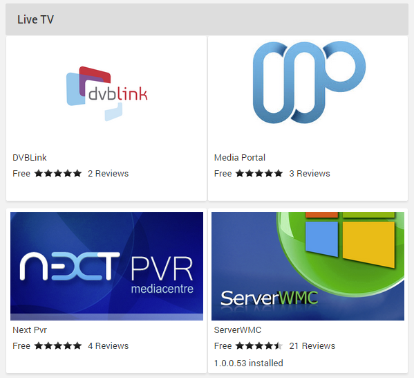

Out of the box, Emby supports the most popular tuners on the market. If you need to add support for other tuners, need specific tuner functionality not included in the base Emby TV experience or already run a dedicated DVR/PVR server you can install a Live TV Plugin to gain functionality of an external program dedicated to your needs.

Emby Server currently supports the most popular DVR servers on the market including:
* DVBLink
* DVBViewer
* MediaPortal
* NextPVR
* ServerWMC
* TVHeadEnd
* TVMosaic
* Vu+

Please note that each plugin depends on a standalone application of the same name. For example, the ServerWMC plugin for Emby requires the standalone ServerWMC application, the NextPVR plugin requires NextPVR installed on your network, etc

Each plugin will provide it's own documentation, including the tuner hardware supported as well as the installation requirements.

## How to Install a Live TV Plugin

Live TV Service providers are available in the plugin catalog. 

To browse the catalog, open the server dashboard and navigate to **Plugins** -> **Catalog**.

For more information on plugins, as well as how to install and configure them, see [Plugins](Plugins).

## Service Provider Settings

To configure the settings for your service provider, simply click on it within [My Plugins](Plugins#my-plugins). 
