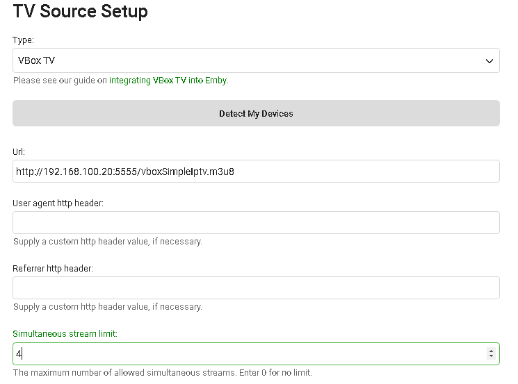

Emby Live TV supports setting up VBox TV Gateway as a TV Tuner source. Once you have VBox TV Gateway setup and ready to use it's very simply to add to Emby. You do not need to setup guide data in VBox TV Gateway as we will set this up in Emby.

Click the Live TV menu option from the web admin and you will see a screen similar to this.

Click the + sign next to TV Sources and you will get the following screen:

Select the VBox TV option from above and more options will appear looking similar to this:

All you have to do is type in the URL to your VBox TV Gateway machine like shown in the above picture.  Just change the IP shown above to match the IP of your device.

You can optionally set a specific tuner count as done above.

Click SAVE when finished and your new tuner will be ready for use.

If you've changed ports or don't know the IP just login into your Vbox device in a web browser and select Streaming->IPTV menus and you'll see a screen similar to this:

You want to use the SimpleIPTV M3U8 URL.
