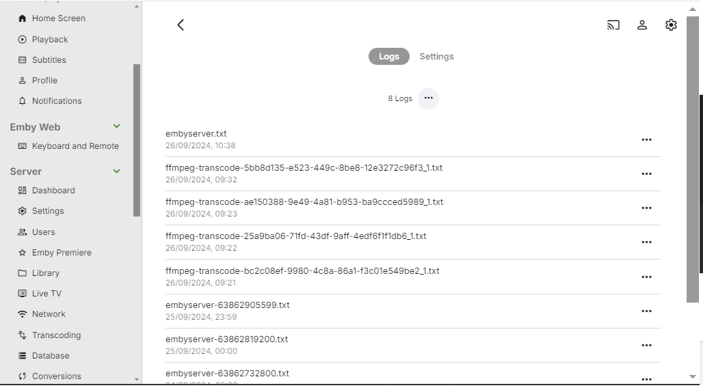
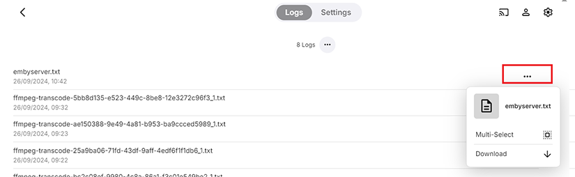
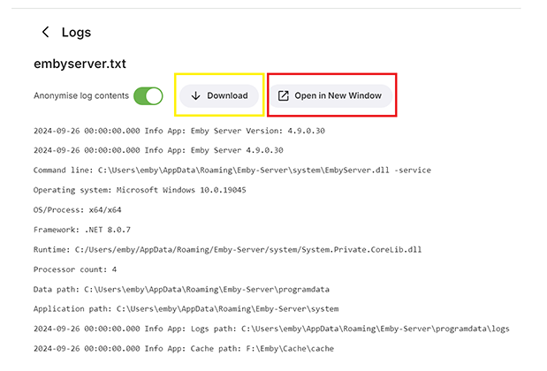
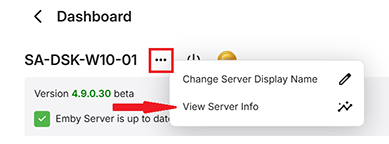
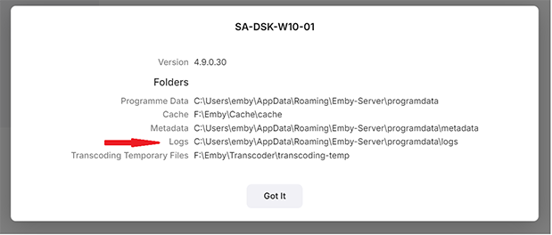
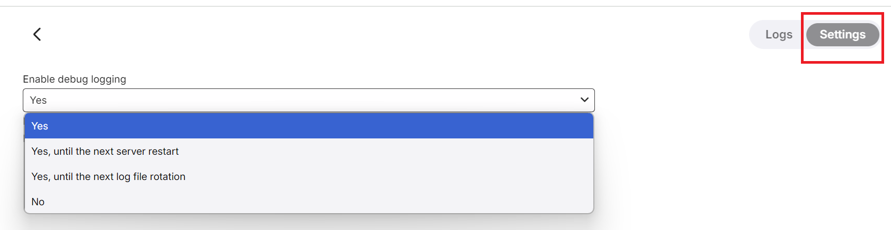

You can access Emby Server Log files from the dashboard UI by navigating to **Logs** under the Advanced menu.  You will see a list of log files on the right where you can do one of the following:

- Click on the **...** to the right of the log file name and then choose Multi-Select or Download. If multi-selecting log files, clicking on the **...** after selecting log files would offer the option to download, or
- Click on one to open it in the web browser
- Click the icon in the red box below to open the log file in a new tab.
- Click the icon in the yellow box to download the log file.  

Downloading the logs through either method anonymises the log files and is the recommended way when needing to upload the log files for support.







The physical location of log files is displayed on the **View Server Info** button which is available through the **...** button next to the server name on the server dashboard main page. 





## Log Rollover
By default, Emby Server will start a new log file every day at midnight. The current log file will be renamed and postfixed by a timestamp value.

You can control log rollover through in the Scheduled Tasks section by modifying the execution schedule of the **Rotate log file** task

## Log file types

There are four types of log files:

- embyserver_xxxxx.txt  
The main server log file, rotated as described above. The current log file would just be called embyserver.txt

* ffmpeg-xxxx.txt
Transcoding logs created for each transcoding or remuxing operation

* hardware_detection-xxxxx.txt  
Hardware detection log. Created on every startup of Emby Server

* quick-extract-xxxxx.txt  
ffmpeg logs for image extractions

## Debug Logging

A setting is available to allow you to enable additional debug logging. The following shows the various options available. By default, debug logging is not enabled. Debug logging should only be enabled when specifically requested to do so for a specific problem investigation.




## Fail2Ban Support

Emby Server creates log entries for authentication failures that are compatible with Fail2Ban:
The schema is:

```
AUTH-ERROR: {0} - {1}
```
where {0} is the source IP address and {1} is the error message.


For example:
```
2018-12-28 00:00:00.007 Error AUTH-ERROR: 1.1.1.1 - Invalid username or password entered.
```
