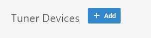
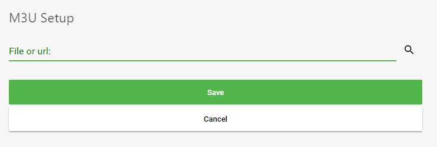

Emby Live TV supports setting up M3U files as TV Tuners. Each M3U file will contain a list of channels, along with information such as channel name, id, and how to play the channel.

See examples of m3u files at http://xmtvplayer.com/build-m3u-file

To add an M3U tuner, simply open the Emby Server dashboard, navigate to Live TV, then click Add underneath tuner devices.

On the M3U Tuner setup screen, you'll need to enter the path to an M3U file.

Emby will accept either:

* A file path to an M3U file
* A url to an M3U file that can be downloaded

The following M3U properties are supported:

* tvg-name - Channel name
* tvg-id - Channel unique id
* tvg-chno - Channel number
* tvg-shift - Number of hours to shift the epg (only used as needed)

If any are missing, Emby will attempt to automatically detect the information using whatever tags are available.