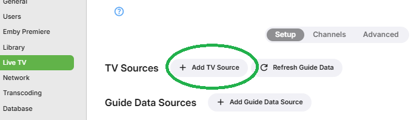
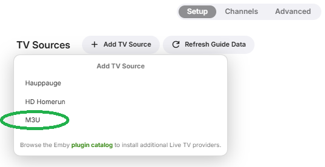
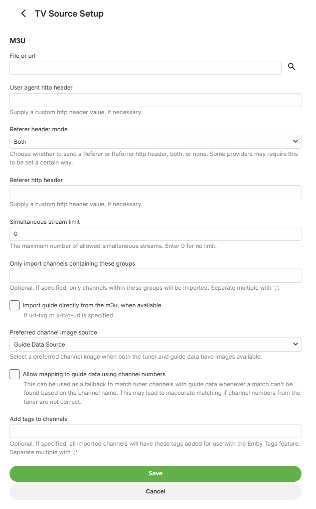
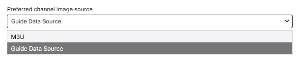

Emby Live TV supports setting up M3U files as TV Tuners. Each M3U file will contain a list of channels, along with information such as channel name, id, and how to play the channel.

To add an M3U tuner, simply open the Emby Server dashboard, navigate to **Live TV Setup** and click **Add TV Source**



Then select **M3U**




On the M3U Tuner setup screen, Emby will accept either:

* A file path to an M3U file
* A URL to an M3U file that can be downloaded

The setup page will have the options showing on the screenshot below. 

Leaving the **Referer http header** and **user agent http header** fields blank will result in Emby Server's default values being used.

It will be possible to choose how the **Referer** header item is included in the streaming requests. Some providers may only accept **Referrer**, whilst others may expect it to be **Referer**. The default is to include both variants. You have a choice of including both, either **Referer** or **Referrer** or none. The wrong **Referer** or **User Agent** could give rise to http 403 (Forbidden) errors being returned.

You can also set the simultaneous stream limit if there is one.



## M3U properties

The following M3U properties are supported:

* tvg-name - Channel name
* tvg-id - Channel unique ID
* tvg-chno - Channel number
* tvg-shift - Number of hours to shift the EPG (only used as needed)
* tvg-group - Group the channel belongs to for group management of the guide.  These groups will be imported as tags by Emby for use in parental filtering as well.

If any are missing, Emby will attempt to automatically detect the information using whatever tags are available.


There is a choice for the channel image source, using a Guide Data source or the m3u for channel images.




## Example M3U

```
#EXTM3U

#EXTINF:10.000000,TVG-ID="Channel1" tvg-name="Channel 1" tvg-logo="http://example.com/channel1.png" group-title="Entertainment",Channel 1
http://example.com/stream1.ts

#EXTINF:10.000000,TVG-ID="Channel2" tvg-name="Channel 2" tvg-logo="http://example.com/channel2.png" group-title="Entertainment",Channel 2
http://example.com/stream2.ts
```
