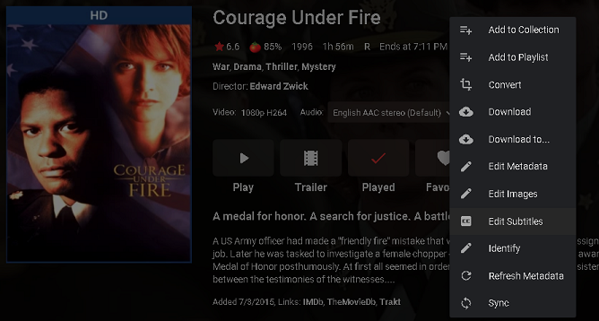
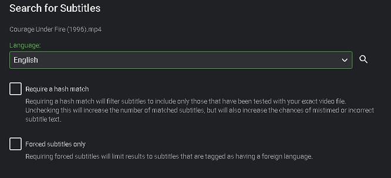
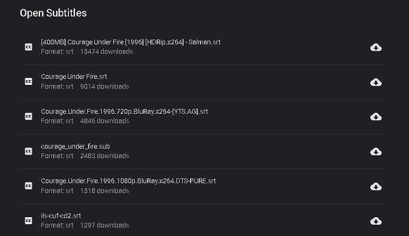
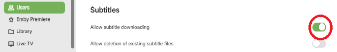
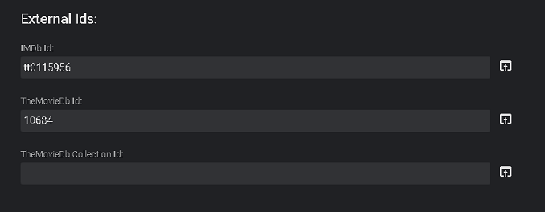

Emby allows you to manually download subtitle files for your media as needed.  There are multiple subtitle plugins that can be used.

## Install a Subtitle Plugin

Before being able to setup downloading of subtitles you will need to setup a plugin such as [Open Subtitles](Open-Subtitles.md). Please make sure you have configured your plugin before continuing.

### Manual Subtitle Download

From a video file click the 3 dot/more menu and select the Edit Subtitles menu choice from the popup menu.

You will get a new screen with a couple of option. Select the language 

and any options you need and then click the magnifying glass/search icon.

The page will expand with any subtitles it found that matched your results and will look like this.

All you have to do now is click the download arrow in the cloud to the right side of the subtitle you wish to download. Once you click this the Emby Server will queue the file for download and it will be available for use very quickly.

> [!Note]
> if you do not see any subtitle appear for download (as above) then that would mean that Emby could not find any subtitles that match your criteria.  You can try and change any options you set or possibly try to search for "English" subtitles (if not already).  Some movies will not have subtitles available.

> [!Note]
> if you do not see the option to search, have the server user settings checked for having permission to download subtitles.
>

If you have problems finding subtitles, please verify that the movie/show was identified correctly.  You can manually check IMDB Id using the Metadata Manager.  When using this scroll down the the External Id section and very the IMDB Id is correct.  This section will look similar to this.

