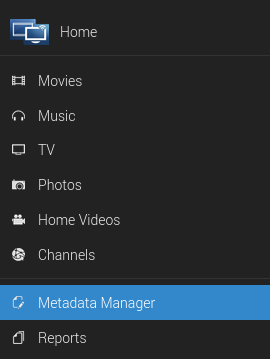
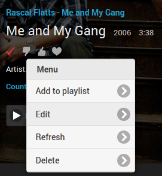
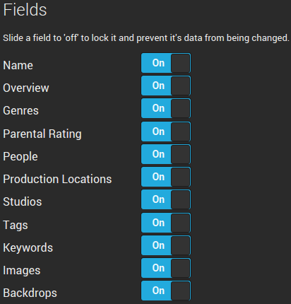
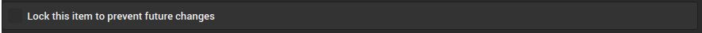
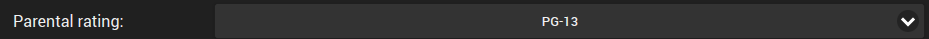
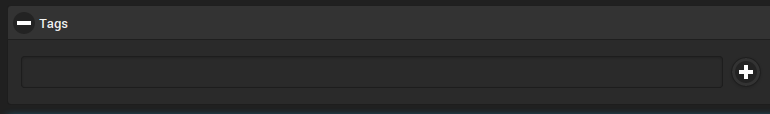
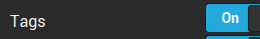
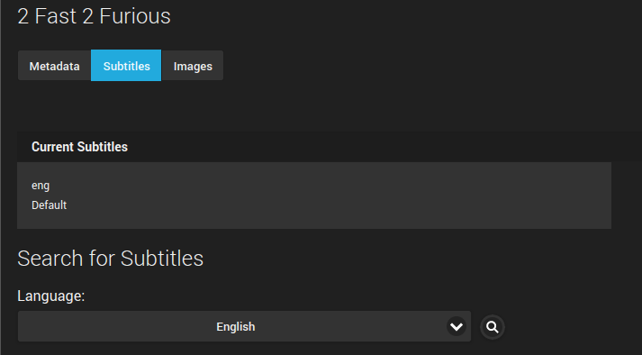
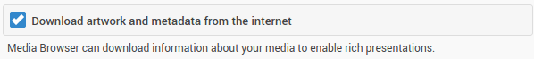
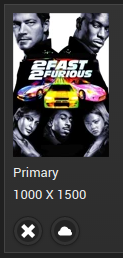

One of the areas in which MediaBrowser shines as a media server is the metadata management. The server has a metadata manager which allows you to view all of the metadata for every item in your library in one place.

The metadata manager can be accessed via the slideout in the web client in the top left hand corner of the screen.

Another way to access the metadata manager is via **Options**->**Edit** of the item you would like to edit. This method will take you directly to the item in the editor.

## Using the Metadata Manager

#### Refreshing metadata

Each media item has the option to **Refresh** itself. Selecting refresh will pull fresh metadata from each of the databases that the server is configured to pull from. In addition, it will download any images that may be missing (logos, disc images, posters, etc.).

If you select the **Advanced refresh** button, you will get a popup with several options for what should be refreshed.

The **Metadata refresh mode** options will only affect the text metadata.
 
- Refreshing all data (the default option) will overwrite all of the fields with metadata from outside databases.
- Refreshing only missing data will preserve all of the existing metadata and only populate the fields that are missing metadata.
- A local refresh will make the server reread the NFO or XML file that contains the metadata.
- Selecting **None** will not refresh any of the metadata.

The **Image refresh mode** options will only affect the images that the server uses.

- Download only missing images (the default option) will only download images that are missing from the existing image collection.
- Download and replace images will force the server to redownload all of the images for the media item.
- Selecting **None** will prevent the server from changing any of the existing images and keep it from downloading more.

#### Identifying items

All media can get their information from online databases such as TheMovieDB and TheTVDB. If an item is misidentified by the server, you can manually identify the item using the **Identify** button, or, if you already know the database IDs for your incorrectly identified item, simply insert the correct IDs into the database fields and refresh the item.

#### Database IDs

Database IDs are extremely important to the server to determine what each media item is and whether it has been watched.

One catch to this approach is that media items with the same IDs (for example, a movie that has both a 3D and 2D version) will be treated by the server as the exact same item regardless of the existence of two separate files. This can mean that it can show up in the Resume tab or other places twice. Also, if you watch the 3D version but not the 2D version, the server will mark both formats as watched.

#### Saving metadata

Be sure to hit **Save** after changing ANY metadata; otherwise, all of your changes will be lost when you navigate away from the page. If you wish for the changes that you made to be persistent through a refresh of the item, you will need to either lock the metadata field you changed, or lock the entire item.

## Parental Controls and Metadata

You should be aware that there are certain metadata fields that affect the use of parental controls.

One good example of such a metadata field is the parental rating. The parental rating can be used to set whether a server user can access content that is above a certain rating, e.g. allowing a teen to access content rated PG-13 or below while restricting access to content rated at R or above.

Another metadata item that you can use to prevent a user from accessing certain content is the **Tags** metadata field.

To keep a user profile from accessing certain content

- Tag each item that you want to prevent access to with a unique tag.
- Go to the **Users**->**Parental Control** in the server dashboard.
- Add the unique tag to the **Block content with these tags** field.
- Save the changes to the user profile and media tags.

To make sure the tags don't disappear in a library refresh, lock the **Tags** field in the item's metadata.

## Subtitles

For your movies and TV shows, the metadata manager is the place to manage subtitles . You can see which subtitles you have, whether they are graphical or text, and what languages the subtitles are in.

To enable access to the OpenSubtitles database, you will need to enter your account information in **Metadata**->**Subtitles** in the dashboard. This area is also the place to manage what will be automatically downloaded when the **Download missing subtitles** task in **Advanced**->**Scheduled tasks** is run.

## Images

MediaBrowser can automatically download images to improve the presentation of media in each client. To enable automatic image downloading, you will need to have the **Download artwork and metadata from the internet** option checked in **Metadata**->**Basics** in the dashboard.

Images are downloaded from Fanart.tv, TheMovieDB, The Open Movie Database, and TheTVDB. The images tab in the metadata manager can be used to modify what images the server presents for your MediaBrowser clients.

To change the image used, simply click on the cloud underneath each image and the server will search all of the databases for new images.

