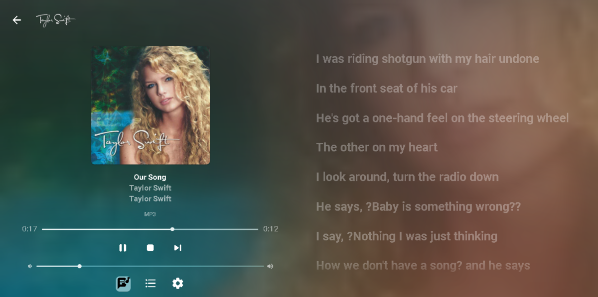

## Embedded Lyrics Support for Music Files

Emby now supports display of musical lyrics you provide.  This doesn't require modifying your actual music tracks but is done using a text file residing next to the track!

You can quickly and easily use a tool such as MediaHuman Lyrics Finder that makes quick work of adding Lyrics to your existing content.  Rescan your music library and have this:

This is a great new feature that's easy to implement, uses hardly any storage space (text files) and gives you great results! (first icon bottom left)

 
## Audio now playing screen

The above picture shows one view of our new audio Now Playing Screens. Here's another version of the same screen without the lyrics showing your current queue:

