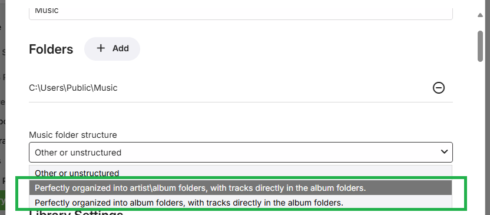
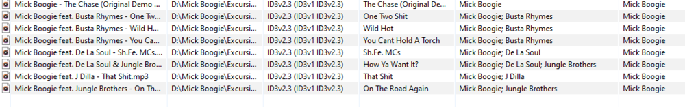

Emby is completely tag based which means all information is read from the tags embedded in your music tracks. Folder structure in Emby 4.6 and later versions is not mandatory but can be a useful way to organize you media.


The recommended folder structure for music is Artist\Album\Song

```
 \Music
    \Artist Name
       \Album Name
          1- Song.mp3
          2- Song.mp3
```

This is not a requirement and other structures will also work, but this is the most common method. Some other examples of supported structures are Album\Song:

```
 \Music
    \Album Name
          1- Song.mp3
          2- Song.mp3
```

Or even a flat library of song files:

```
 \Music
    1- Song.mp3
    2- Song.mp3
```

Any naming convention for audio files is acceptable. Track numbers are retrieved using embedded ID3 tag information. 

Your first step in setting up a music library is to select your folder structure.

Either of the perfectly organized structures will allow for existing disc-based images to be used.


> [!Note]
> Emby Server supports any folder structure for music libraries, but if you wish to save metadata files directly into your media folders such as nfo, images, etc, then then a structured folder layout is necessary to help Emby Server understand which folders correspond to your albums and artists.   Emby Server will happily read these metadata files from the directories in your media or from the global metadata area it manages.



If it's important to you to have these files written and stored next to your media, make sure to use one of the perfectly organized options above in the dropdown, preferably the artist\album option in the middle. What you choose in the dropdown needs to match the layout on disk. Having a hierarchy of both artists and albums provides the most flexible and organized solution.  

> [!Note]
> If you wish to have custom artwork and there are multiple instances in the library or other music libraries of the Album folder, as an example, you need to make sure that the the custom art files are the same in all the instances of the folder.


## Music Images

Images are supported in both artist and album folders, as well as images embedded within audio files. Below is a table of the supported image file names:

Supported image extensions are **jpg**, **jpeg**, **png** and **tbn**.

Several image types support multiple file names. They are listed in the order that they're checked for.

| Image Type | Supported file names                |
|------------|-------------------------------------|
| Primary    | folder.ext                          |
|            | poster.ext                          |
|            | cover.ext                           |
|            | default.ext                         |
| Art        | clearart.ext                        |
| Backdrop   | backdrop.ext, backdropX.ext         |
|            | fanart.ext, fanart-X.ext            |
|            | background.ext, background-X.ext    |
|            | art.ext, art-X.ext                  |
|            | extrafanart (subfolder)/fanartX.ext |
| Banner     | banner.ext                          |
| Disc       | disc.ext                            |
|            | cdart.ext                           |
| Logo       | logo.ext                            |
| Thumb      | thumb.ext                           |
|            | landscape.ext                       |

For backdrops, X represents a number, and you can have any amount of numbered backdrops. For example:

```
 \Music
    \Artist Name
       backdrop.ext
       backdrop1.ext
       backdrop2.ext
       backdrop3.ext

```

## Tagging Your Tracks
All music tracks should be tagged with whatever information you want displayed in Emby.  Emby should support all common tags written by Musicbrainz Picard. Other common software used to alter/write tags is Mp3tag and Tagscanner.


Please make sure to write all tag version or to remove old tags. All tags should be written using unicode format. 

Tagging your albums and tracks should be straightforward with the possible exception of various artist or compilation albums.


For these types of compilation albums if you want all tracks to show up as a single entity you want to make sure both the "album" and "album artist" fields are the same for all tracks. Otherwise the album will be split up for the various artists listed.

> [!NOTE]
> Where there is not a single artist you can assign to a compilation album in the 'album artist' tag, you can set it to 'Various' or other unique value.


For the 'artist' tag, multiple artists can be listed for tracks and should be separated with a "; " (semicolon space) as shown below.



> [!NOTE]
> if you have an artist with two albums of the same name you will need to use mbzalbumids or slightly change one title to differentiate the albums or they will get combined. An example is artist Kim Wilde who has two albums name "The Very Best Of Kim Wilde", one from 1984, one from 2001.


## Music Videos

To add music videos, setup a library with the type "Music Videos". The naming conventions for music videos are identical to [movies](Movie-Naming.md).

To identify the artists and albums of music videos, use the [metadata manager](Metadata-manager.md). Simply edit a music video:


Then enter the artist(s) and/or album:


Once complete, the artist and album pages will display links to the music videos.

> [!NOTE]
> You need to make sure your music files have been properly tagged using a 3rd party program. Emby uses these tags for identification.

For Music videos you need to name these files the same as on the meta-data provider website which is https://imvdb.com/  

Emby will use Album artwork that is local but will always pull down the Artist & People from the MetaData providers.