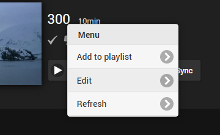
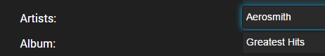

The recommended folder structure for music is Artist\Album\Song

```
 \Music
    \Artist Name
       \Album Name
          1- Song.mp3
          2- Song.mp3
```

This is not a requirement and other structures will also work, but this is the most common method. Some other examples of supported structures are Album\Song:

```
 \Music
    \Album Name
          1- Song.mp3
          2- Song.mp3
```

Or even a flat library of song files:

```
 \Music
    1- Song.mp3
    2- Song.mp3
```

Any naming convention for audio files is acceptable. Track numbers are retrieved using embedded ID3 tag information. 


## Music Images

Images are supported in both artist and album folders, as well as images embedded within audio files. Below is a table of the supported image file names:

Supported image extensions are **jpg**, **jpeg**, **png** and **tbn**.

Several image types support multiple file names. They are listed in the order that they're checked for.

| Image Type | Supported file names  |
| ------------- |---------------|
| Primary      | folder.ext |
|              | poster.ext |
|              | cover.ext |
|              | default.ext |
| Art      | clearart.ext      |
| Backdrop  | backdrop.ext, backdropX.ext |
|           | fanart.ext, fanart-X.ext |
|           | background.ext, background-X.ext      |
|           | art.ext, art-X.ext      |
|           | extrafanart (subfolder)/fanartX.ext      |
| Banner   | banner.ext      |
| Disc      | disc.ext      |
|           | cdart.ext      |
| Logo     | logo.ext      |
| Thumb     | thumb.ext      |
|           | landscape.ext      |

For backdrops, X represents a number, and you can have any amount of numbered backdrops. For example:

```
 \Music
    \Artist Name
       backdrop.ext
       backdrop1.ext
       backdrop2.ext
       backdrop3.ext

```


## Music Videos

To add music videos, setup a library with the type "Music Videos". The naming conventions for music videos are identical to [movies](Movie-naming).

To identify the artists and albums of music videos, use the [metadata manager](Metadata-manager). Simply edit a music video:



Then enter the artist(s) and/or album:



Once complete, the artist and album pages will display links to the music videos.