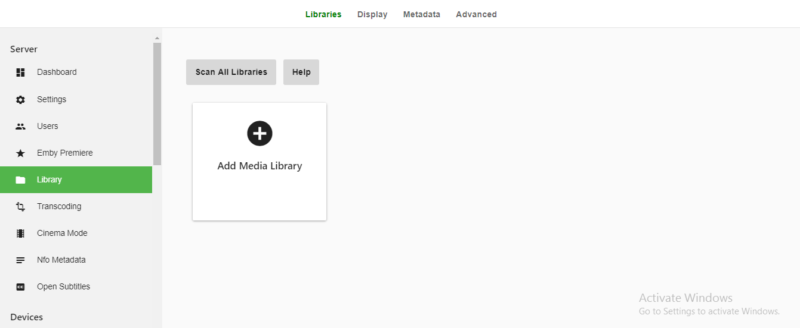
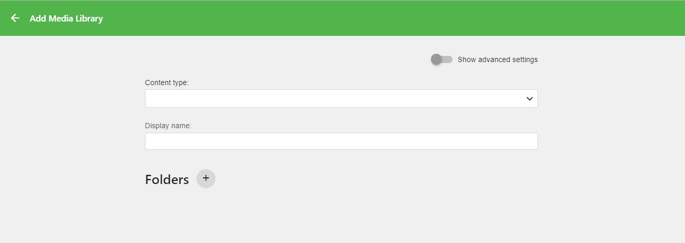
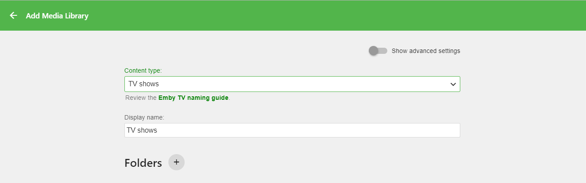
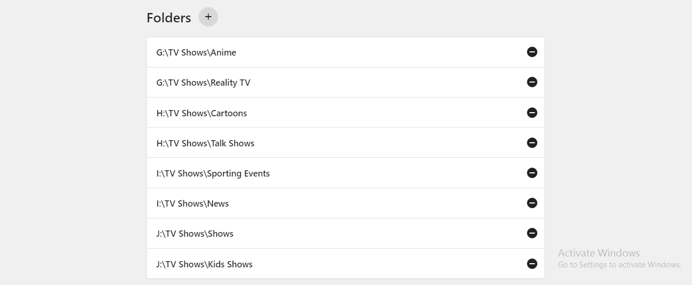
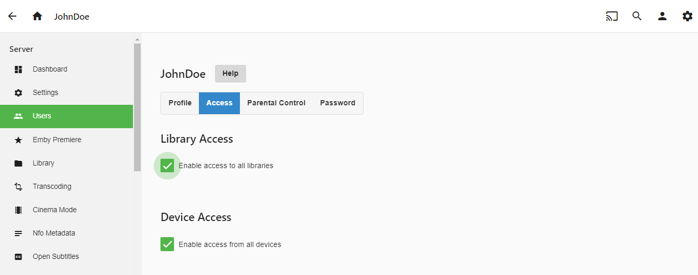
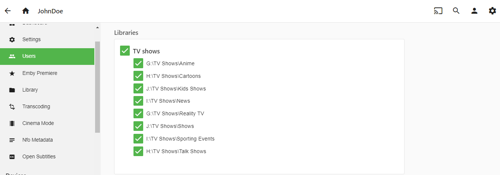
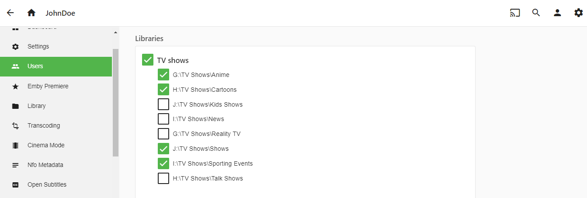
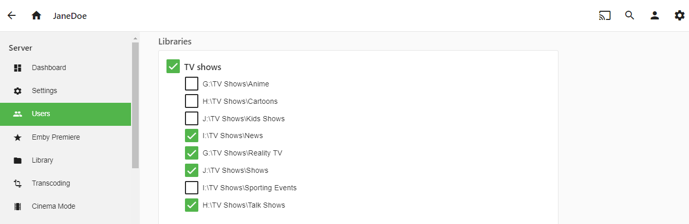
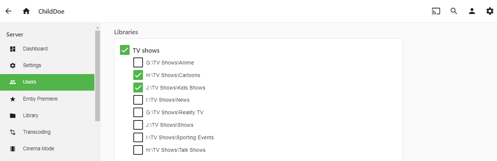

Emby 4.0 includes a new way to do Merged Libraries that is very powerful.  If you were using merged libraries in a previous version of Emby you will want to redo your setup to take advantage of this new server based way to accomplish the same thing.  The previous method was a user preference to combine different libraries of liked content.  Now with version 4.0 this is all handled in the library access control making it much easier to manage.

To get an idea of what merged libraries are and how to effectively use them let’s take an example where you have multiple types of TV Show content broken up and stored on disk by categories. Below is the category of TV Show and the physical location to the parent directory of each.

* Anime – G:\TV Shows\Anime
* Reality TV – G:\TV Shows\Reality TV
* Cartoons – H:\TV Shows\Cartoons
* Talk Shows - H:\TV Shows\Talk Shows
* Sporting Events – I:\TV Shows\Sporting Events
* News – I:\TV Shows\News
* Kids Shows – J:\TV Shows\Kids Shows
* Shows – J:\TV Shows\Shows

## Setup the Library

What we are going to do is create ONE library called “TV Shows” that contains these 7 folders.  We’ll do this the normal way by selecting LIBRARY from the administration web panel. We should then be presented with the following:

Select "Add Media Library" to get to this:

We will now select the content type from the drop down menu of “TV Shows” and we will also use the default library name of “TV Shows”. You can change this name to anything you want.

Now the last thing we need to do to have a working “TV Show” library is to add each of the parent folder mount points shown above for this example. We do this by clicking on the + (plus sign) next to the word “Folders” above.  Once we have added each of these parent folders this section will look like this:

All that is left to do is click the OK button to create the library (click it).  NOTE: You may configure other library options including advanced options but they are beyond the scope of this example.

## Configure Permissions

Now that we have our new TV Shows library setup, it’s time to configure access permission to this library.  Here is where the power of Merged Libraries comes into play.  We are going to set access permission for our fictitious “JohnDoe” user and then we’ll show permissions for “JaneDoe” & “ChildDoe”.  This will show how easy it is to have one master TV Show library but give different access to different parts depending on what content they are interested in or what content you as the administrator want them to have.

From the administration web panel select the USERS menu on the left.  You will then have a list of users already setup on the system in the right panel.  We will pick “JohnDoe” who we already created.
In the right panel you will see a menu of choices up top and will want to select ACCESS.  You should then be at a screen that looks similar to this:

Now for this example instead of granting access to all libraries (top checkbox in the right panel) we want to grant partial access to our new TV Shows library (only library configure on this system).  So we un-check the “Enable access to all libraries” option and have a screen that looks similar to this:

All we have to do at this point is make sure only the sections we want this user to have access to have a check mark.
If we wanted “JohnDoe” to only have access to Anime, Cartoons, Shows & Sporting Events the configuration would look like this:

Once you’re happy with the library selections just click SAVE at the bottom of the page in the right panel!

## Providing Different "views" for Different Users

You can use this access control to provide different views of the same library just like merged libraries before.  For example, imagine “JaneDoe” isn’t interested in any type of cartoons, kids shows or sports but very much likes News, Reality TV and Talk Shows as well as the normal collection of Shows.

You can tailor her view of the TV Shows library by setting her access as follows:

Then, you could also have "ChildDoe" and configure them to only see Cartoons and Kid's shows like this:

So to recap:

* JOHNDOE has access to Anime, Cartoons, Shows, Sporting Events
* JANEDOE has access to News, Reality TV, Shows, Talk Shows
* CHILDDOE has access to Cartoons, Kid Shows

But each one of them sees the same "TV Shows" library on their home screen.  It is just tailored to their specific needs.