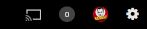
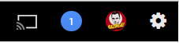
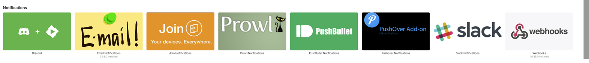
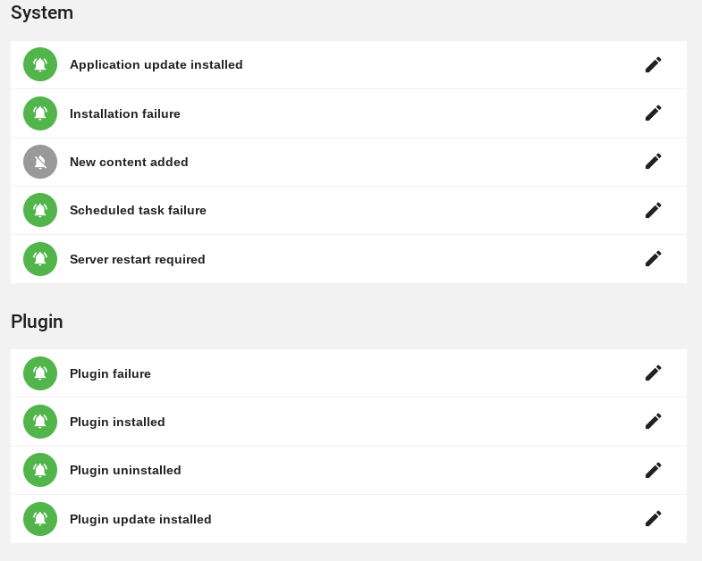
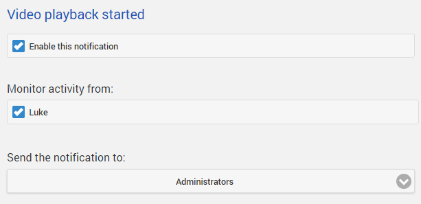
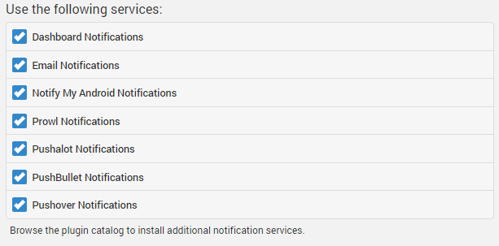
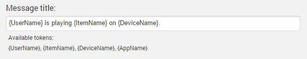

Server notifications allow you to stay informed of your server's activity.

## Notification Services

Notification services represent the ways in which notifications are sent out. Notification services are available for email, Android, iOS, Windows, and more. 

Out of the box the server includes one notification service, the built-in server dashboard notifications. Dashboard notifications appear in the top right-hand corner of the web interface:

The bubble shows 0 for no new notifications, and will change color as new ones are received:

To install new notification services, open the server dashboard, navigate to the **Plugin Catalog** and scroll down to the Notifications section. A number of options are available:

Installing a notification service is just like any other Plugin. After installation, most notification services will require configuration of accounts or devices. For more information on installing and configuring Plugins, see [Plugins](Plugins).

## Configuring Notifications

After choosing the notification services you'd like to use, it's time to configure the individual notifications you'd like to receive. Begin by opening the server dashboard and navigating to **Notifications**.

The page will display the available notifications, as well as their current status:

To configure a notification, simply click on it. You'll then be taken to the notification configuration page. There are a number of ways notifications can be customized.

First, you can select whether or not to enable a notification, and who to send them to. If a notification involves monitoring user activity, you can also select which users to monitor:

Additionally you can configure which notification services to use:

And you can also customize the message title:

