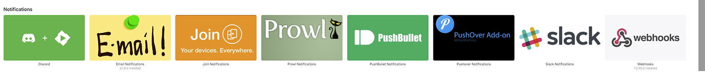

Server notifications allow you to stay informed of your server's activity.

## Notification Services

Notification services represent the ways in which notifications are sent out. Notification services are available through a number of Plugins. To install a notification service, open the server dashboard, navigate to the **Plugin Catalog** and scroll down to the Notifications section. A number of options are available:

Installing a notification service is just like any other Plugin. Read the instructions for the Plugin. In some cases, it is just a matter of setting up within the Notifications Emby Server **Add notification** interface. For more information on installing and configuring Plugins, see [Plugins](Plugins.md).

## Configuring Notifications

After choosing the notification services you'd like to use, it's time to configure the individual notifications you'd like to receive. The Emby server administrator can configure that for specific user accounts, by selecting **Users** from the server settings dashboard and selecting the user account and on the **Profile** tab, clicking on the **Edit this user's profile, image and personal preferences** link and clicking on **Notifications**.

See [User User Preferences - Notifications](User-Prefs-Notifications.md).

