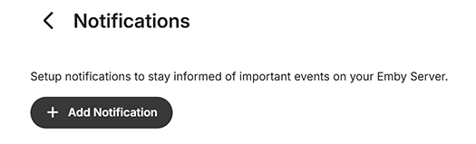
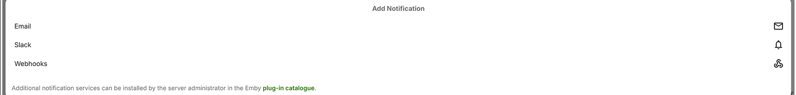
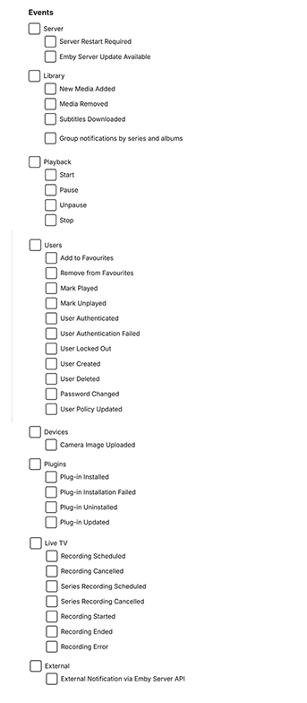

Server notifications allow you to stay informed of your server's activity.

## Notification Services

Notification services represent the ways in which notifications are sent out. Notification services are available through a number of Plugins. To install a notification service, open the server dashboard, navigate to the **Plugin Catalog** and scroll down to the Notifications section. A number of options are available:

Installing a notification service is just like any other Plugin. Read the instructions for the Plugin. In some cases, it is just a matter of setting up within the Notifications Emby Server **Add notification** interface. For more information on installing and configuring Plugins, see [Plugins](Plugins.md).

## Configuring Notifications

After choosing the notification services you'd like to use, it's time to configure the individual notifications you'd like to receive. Begin by opening the server dashboard and navigating to **Notifications** and selecting **+ Add Notification**.

The page will display the available installed Plugins notifications services, as example when Email, Slack and Webhooks Plugins are installed:

To configure a notification, simply click on it. You'll then be taken to the notification configuration page. There are a number of ways notifications can be customized once the notification service specific configuration has been setup and tested.

The following gives the various notifications events that can be selected.

And you can limit the events using the drop-downs available for users, libraries and devices.

