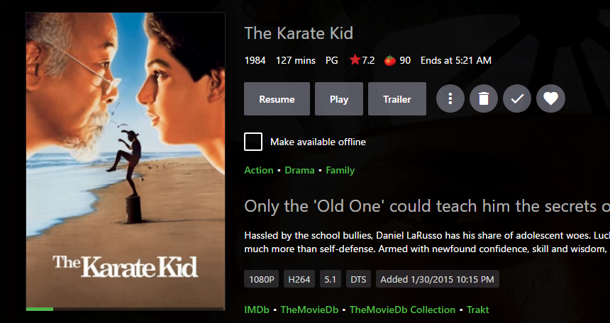
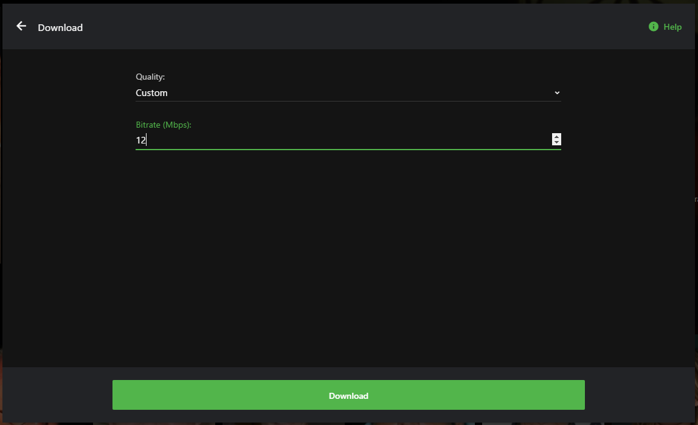

The offline downloading feature allows you to copy your content to mobile devices for offline viewing. Download jobs are created using either the server's web interface or an Emby app on a mobile device. The server will then convert the media for the device as necessary. The apps will then download the content by running a periodic background sync process.

The Emby apps that currently support offline downloading are:

* [Emby for Android Mobile](Android-Mobile)
* [Emby for Windows Store](Emby-Theater-for-Windows)
* [Emby for iOS](iOS)

The feature is also available in the following third party apps:

* Ember for Emby (third party app)

# How it Works

Apps that support offline downloading will display "Make Available Offline" options on media detail screens.

To get started with a download, click "Make Available Offline". You'll then be displayed with a dialog allowing you to select your desired download quality. Emby Server will convert media so that it can be downloaded in a compatible format for the device. You can choose between several quality options, as well as forcing original quality.

**Note**: Forcing original quality may result in a download that is not playable on the device.

Custom quality allows you to set your own desired bitrate:

