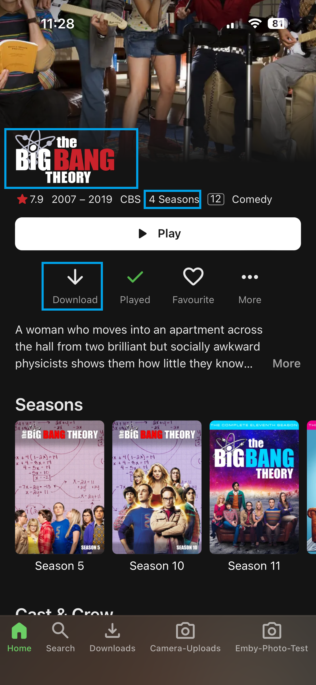
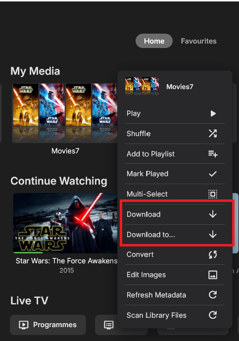
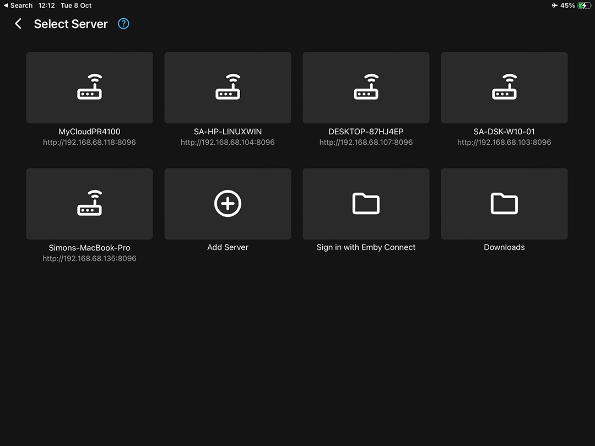
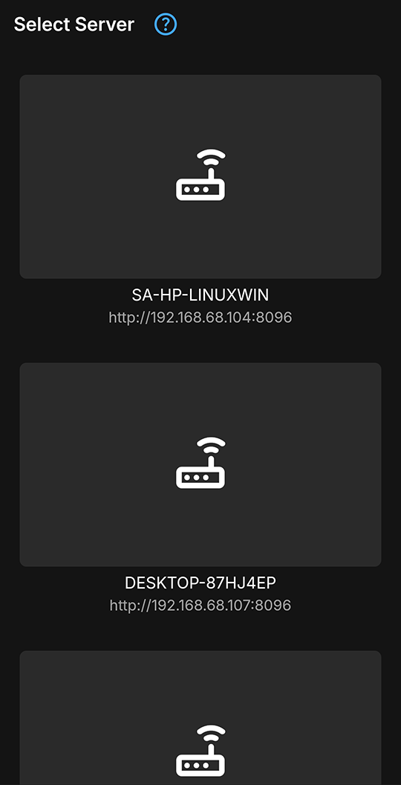
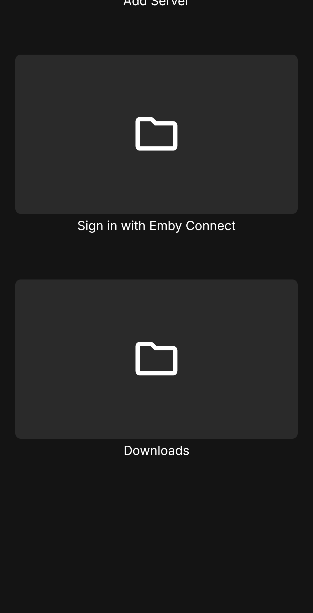
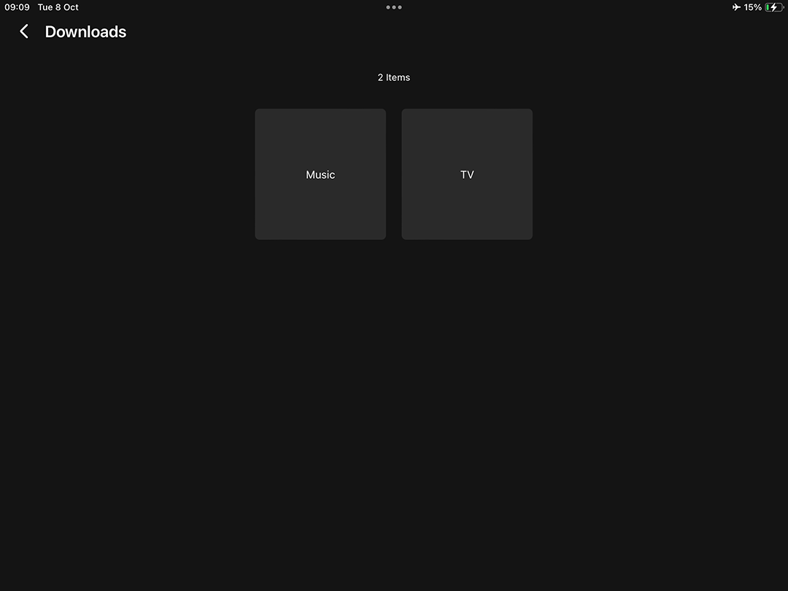
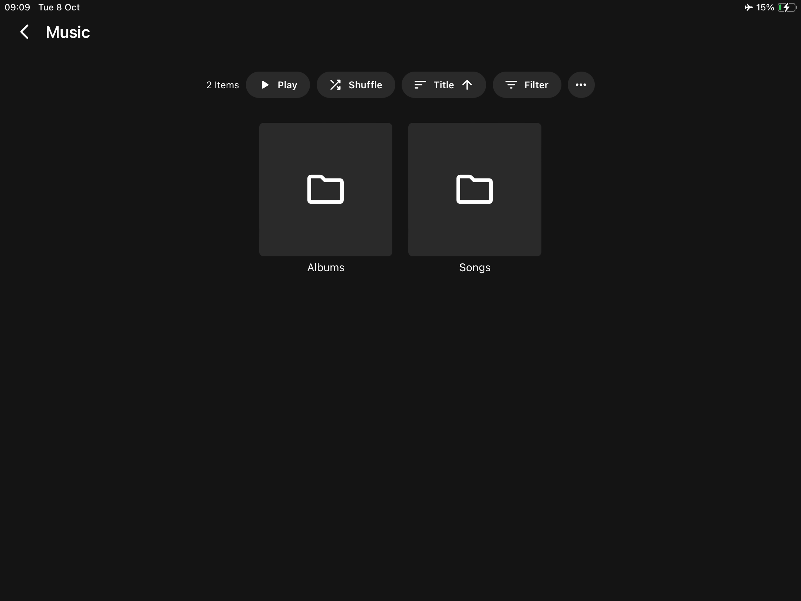
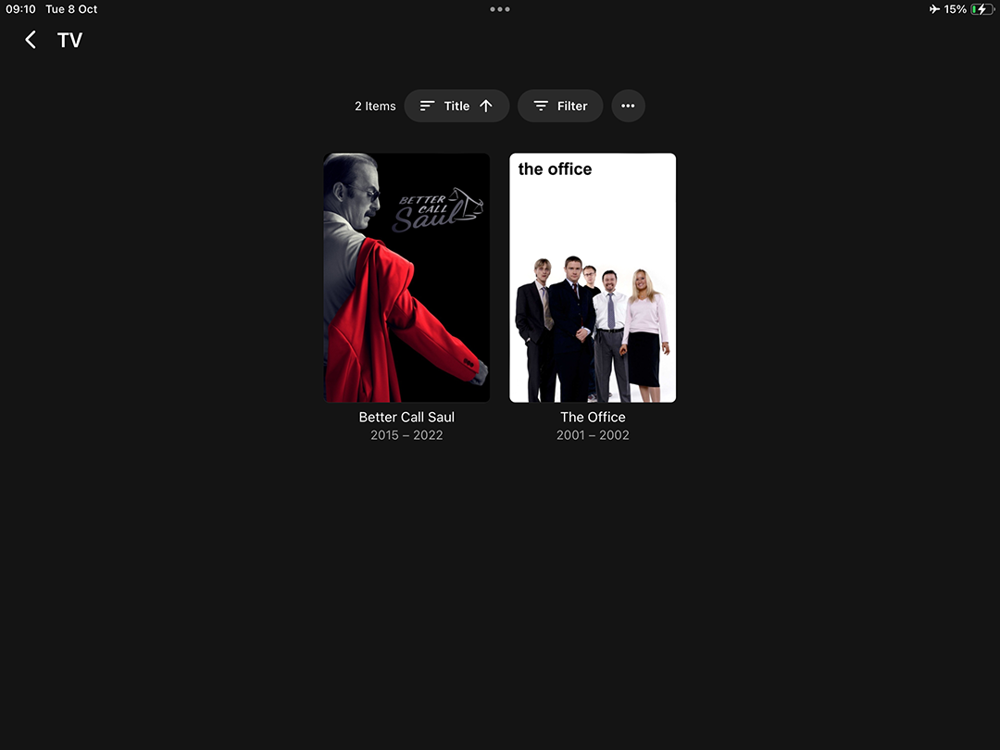

The offline downloading feature allows you to copy your content to mobile device or desktop PC for offline viewing. Download jobs are created using either the server's web interface or an Emby app on a mobile or desktop device. The server will then convert the media for the device as necessary. The apps will then download the content by running a periodic background sync process.

The Emby apps that currently support offline downloading are:

* [Emby for Android Mobile](Android-Mobile.md)
* [Emby for iOS](iOS.md)
* [Emby Windows](Emby-Theater-for-Windows.md)

# How it Works

Emby client Apps that support offline downloading will have a Download icon and the **Download** context menu button. They will also be listed as possible targets of the **Download to** context action.

> [!Note]
> Whilst the Emby Web client app is not listed as an app supporting this feature, it does provide the **Download to** context menu button to initiate downloads to other devices and apps.

Details of the options and settings for downloads can be found in [Download Options](Sync.md).

# Offline Playback

When offline, the Emby Apps will show a button for viewing the available downloads. The following are examples of what the apps would show:

## Emby for iOS

## Emby for Android

When selecting the **Downloads**, you will then be able to drill down:

## Emby Windows

This is similar to the other apps, with the **Downloads** folder showing on the **Select Server** screen when offline.