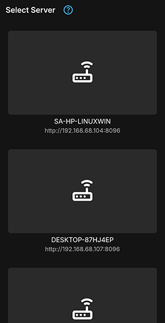
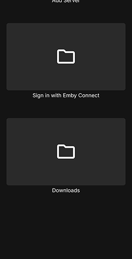

The offline downloading feature allows you to copy your content to mobile devices or a PC for offline viewing. Download jobs are created using either the server's web interface or an Emby app on a mobile device or desktop. The server will then convert the media for the device as necessary. The apps will then download the content by running a periodic background sync process.

The Emby apps that currently support offline downloading are:

* [Emby for Android Mobile](Android-Mobile.md)
* [Emby for iOS](iOS.md)

# How it Works

Emby client Apps that support offline downloading will have a Download icon and the **Download** and/or **Download to...** context menu buttons.

Details of the options and settings for downloads can be found in [Download Options](Sync.md).

# Offline Playback

When offline, the Emby Apps will show a button for viewing the available downloads. The following are examples of what the Emby for iOS and Emby for Android apps would show:

## Emby for iOS

## Emby for Android

When selecting the **Downloads**, you will then be able to drill down:

