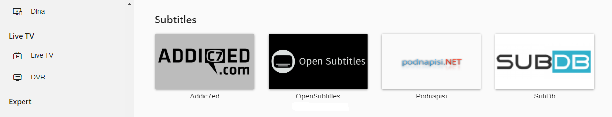

To use Open Subtitles, you need to register an account on the Open Subtitles website.

To do this, click "Open Subtitles" in the side-bar menu of the Emby server dashboard.

Then click on **Register** and the Open Subtitles registration page will open, where you can register an account.

Once registered, enter the username and password in the form above and click Save.

To manage subtitle downloading, click on a library in [Emby library setup](Library-Setup#subtitles), and edit the subtitle downloading settings.

Subtitles will now be downloaded as needed when available, via the Download Subtitles [Scheduled Task](Scheduled-tasks).

Note: Emby also supports other subtitle providers. You can always find the latest list in the [Plugins](Plugins) Catalog.
