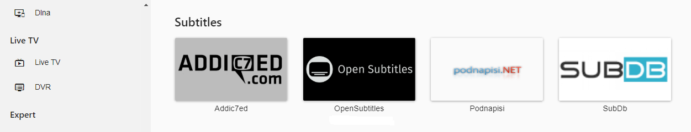

Emby can automatically download subtitle files for your media.  This requires the loading of a plugin and proper setup of your libraries which is shown below. OpenSubtitles is one of many subtitle addons that can be used in Emby including: Addic7ed, NapiSub, OpenSubtitles, Podnapisi & SubDb. You can find the latest list in the [Plugins](Plugins) Catalog.

## Install the Open Subtitle Plugin
To install the plugin, click Plugins in the side-bar menu of the Emby server (Expert Menu) dashboard. Now click the Catalog link at the top of the main page.

Scroll down to the Subtitles section of the catalog to find the Open Subtitles plugin.

You can now click the Open Subtitle entry to bring up the install interface. This will allow you to install the plugin for the first time or to upgrade to the latest version.

You will normally want to choose the latest version in the drop down and then click the install button.  You will see a message on the web dashboard to restart your Emby server to install any new plugins.  Go ahead and restart your Emby server to continue.

## Configure Open Subtitle plugin
After restarting your server, navigate back to the plugin section of the dashboard.  This time make sure to select the "My Plugins" link at the top of the main plugins page.  Once you find the OpenSubtitles plugin click on it and select the Settings option as shown below.

Simply fill in your Open Subtitles username and password that you have previously created at [opensubtitles.org](http://www.opensubtitles.org). If you are a Open Subtitle VIP member also make sure to click the VIP checkbox.  Click the Save button once complete

Once you've installed OpenSubtitles refer to [Automatic Subtitle Downloads](Automatic-Subtitle-Downloads) to learn how to setup your libraries for automatic subtitle downloading.
