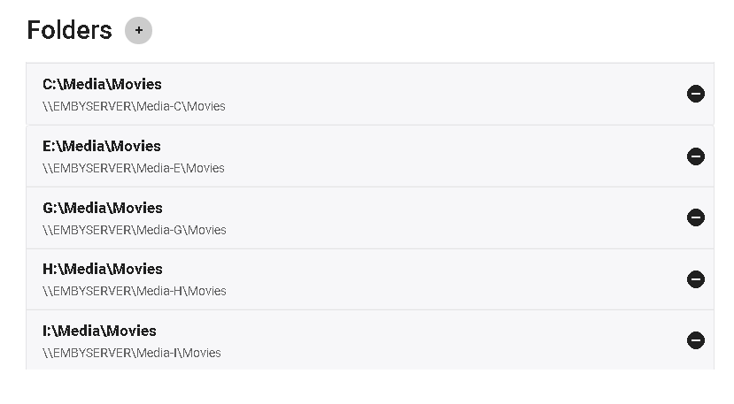

By allowing Emby apps direct access to media folders on the server, they may be able to play them directly over the network and avoid using server resources to stream and transcode. Optional Network Paths can help achieve this without having to change your local mount points.

Network Paths are entered in UNC format and care should be taken to make sure the case (caps and lower case letters) are exact.  Some devices will only mount and use a server name with all capital letters. This will require you to rename your file server and NAS boxes using all capital letters.

### Example:

You have a Movies library on the server using C:\Movies. This folder is also shared on the network with a share name of "Movies-C". The UNC format of this resource would then be similar to \\SERVER\Movies-C

Here are a few examples on a server name EMBYSERVER (using all caps in the name).  There are multiple shares setup on this machine (one for each HDD).

> [!NOTE]
> Please test your UNC path access outside of Emby to make sure apps and devices have proper access. Most OSes will allow you to grant read only privilege's to everyone or to a guest account if needed.