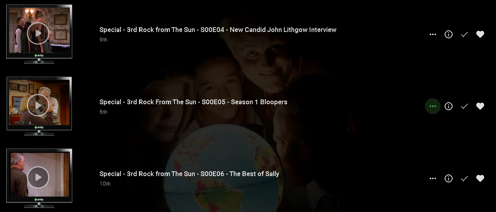
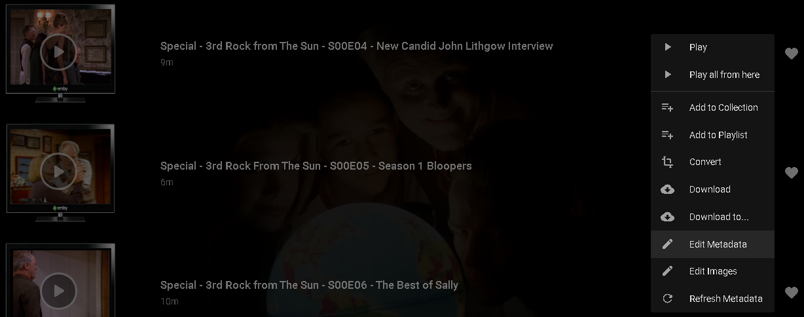

Please follow directions in our TV Naming articles for directions of how to add Specials/Extras to your TV Libraries. Please note the following:

1. Name any Extras that match season 0 from tvdb - with the correct S00Exx 

2. Any remaining extras also name as S00Eyy - where yy is your own numbering - leave a gap between xx and yy so any updates to tvdb do not clash - say start at 50

3. Each S00Eyy episode needs you to specify in the episode metadata when it is supposed to appear and emby will do that for you

4 Optional - you could update the TVDB with your extras that it does not have.

Once you have these extras available in the Specials Season you can edit the metadata for each special and adjust the timeline where it should show.

As an example if we have the following extras and want to place the Season 1 Bloopers (middle video) after Season 1 so they can watched after completing the season we can edit it's meta data as follows.

We start by clicking the 3 dots (in green above) and choose the Edit MetaData

Next we scroll down until will get to the Special Episode Info section which will look like this.

Now we will change the option to display after Season 1.