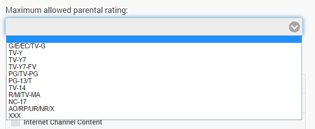
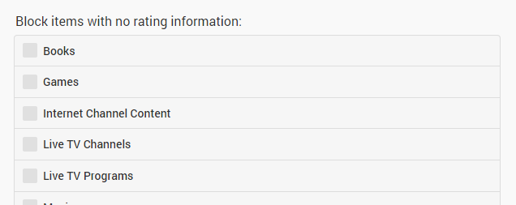
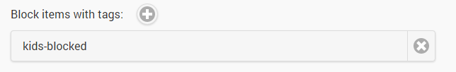
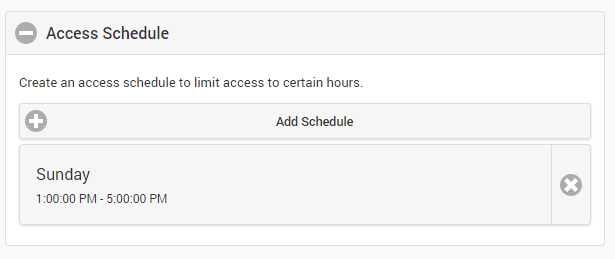

There are a number of tools at your disposal to restrict content from users. To manage parental controls for a user, navigate to the server dashboard -> **Users** -> **Click User** -> **Parental Control**. 

The simplest way is to set the max parental rating for a user.

## Parental Controls via Ratings:

Content with a higher rating will not be displayed. This value will not affect unrated content, but there are additional options to control that as well:

## Parental Controls via Tags:

In addition, you can also restrict content containing certain tags:

For more information on tags and how to configure them, see [Metadata manager](Metadata-manager).

## Access Schedule:

Access schedules allow you to control the days and times during the week in which a user is allowed access to the server:

To add schedules, click the **Add Schedule** button. Once schedules are assigned, the user will only be able to access the server during those listed times.

**Note**: Access schedules cannot be created on administrator accounts.