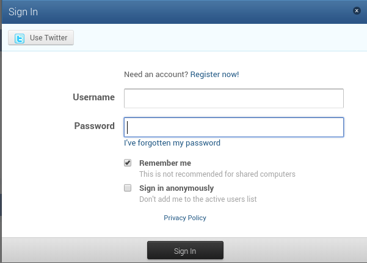
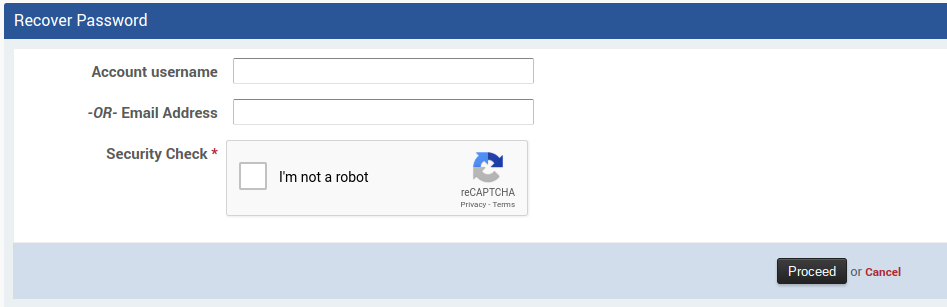
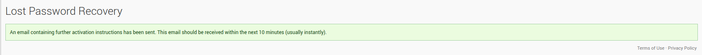

If you have forgotten your Emby Community password, you can reset it.

From the sign-in page, click on "I've forgotten my password".

You will then be presented with a form where you can request a password reset.

Enter either your Emby Community username, or the email address you signed-up with.

Click on the "I'm not a robot" and then click PROCEED.

You will then see confirmation message that a email has been sent to the address entered, or associated with the username entered.

Once the email is received (make sure to check your SPAM folder), simply following the instructions contained within it.
