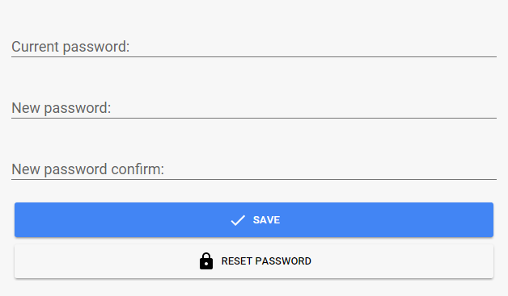
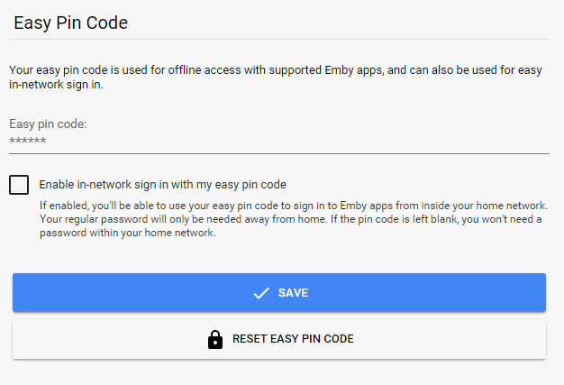

By default, users have the ability to change their own passwords.

If you would like to change the password for a user, navigate to the server dashboard -> **Users** -> **Click User** -> **Password**.

**Note**: Guest passwords are managed by Emby Connect and can only be changed by the user themselves.

## Pin Code

A pin code can be created for apps that support offline access, and for easier in-network sign in with all apps.

To enable in-network sign in with a pin code, simply create a pin and check the option for in-network sign in. As long as you're inside your home network, you'll be able to sign into your apps using your pin code.

**Note**: The local network sign in option may not work correctly if you've configured the server with a reverse proxy. In such a scenario all incoming requests will appear to be local.
