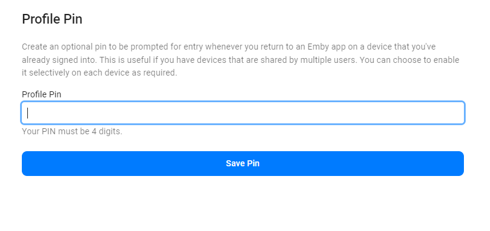

By default, users have the ability to change their own passwords.

If you would like to change the password for a user, navigate to the server dashboard -> **Users** -> **Click User** -> **Password**.

**Note**: Guest passwords are managed by Emby Connect and can only be changed by the user themselves.

By default all Emby apps will require authentication on each device ONCE per user.  After that, the credentials will be remembered on that device enabling easy switching between profiles without needing to re-enter the password.

## Profile PIN (optional)

If you have a shared device where you wish to secure access to one or more users that have been authenticated, you can set a PIN code for that user and then require that PIN be entered any time someone attempts to login or switch to that user.

To enable this feature, simply fill in the Profile PIN field with a 4 digit number (must be numeric and 4 digits for easy entry on shared devices).  

Then, the first time this user authenticates on each device, the app will ask if you wish to enforce the PIN code for access each time.  Answer "Yes" to this and then, each time you return to that profile, the PIN will be required to continue.

> [!NOTE]
> This feature completely replaces the old local network only PIN feature that existed prior to server version 4.8.x.  That local network only PIN is no longer supported as it is inherently insecure.  This new feature should provide better functionality in both local and remote situations in a secure manner.