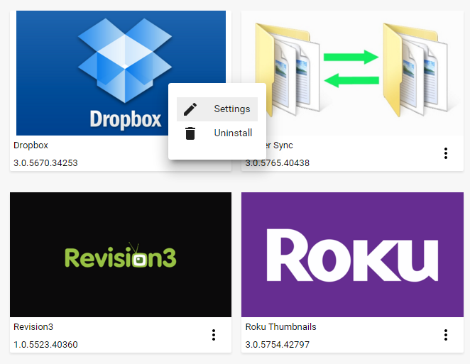
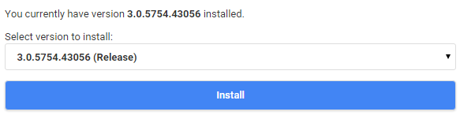

Plugins extend the functionality of Emby by providing additional features and services. To manage your plugins, open the server dashboard and navigate to **Plugins**.

## My Plugins

The my plugins tab displays your installed plugins. Clicking the dot menu on a plugin will allow you to configure it (if applicable), or uninstall it. 

If a plugin does not require any configuration, there will not be a Settings button within it's command menu.

## Catalog

The catalog allows you to browse and install new plugins. Some of the available categories are:

* **Channels** - Internet channels provide access to streaming audio or video. For more information, see [Channels](Channels).

* **Content Providers** - Allows new kinds of media to be added to the library, such as books and games, or allows downloading of related content for existing media.

* **Live TV** - Provides access to live tv channels. For  more information, see [Live TV](Live-TV).

* **Metadata** - Adds new metadata scrapers or filters.

* **Notifications** - Adds new notification targets for use with the notifications feature. For  more information, see [Notifications](Notifications).

* **Social Integration** - Access to social networking features.

## Installing Plugins

To install a plugin, click on one within the plugin catalog. The plugin detail page will then contain an installation button.

Click the Install button install. After the installation has completed, the server will need to be restarted.

## Popular Plugins

The plugin catalog has a vast library of plugins available. Below are some of the more popular choices:

* **[Auto Box Sets](AutoBoxSets)** - Automatically create movie collections based on your movie library
* **Cover Art** - Enhance your media images
* **GameBrowser** - Adds game support to Emby.
* **Trailers** - Stream internet trailers
* **Trakt** - Provides integration to the trakt service