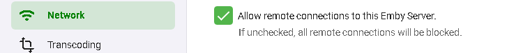
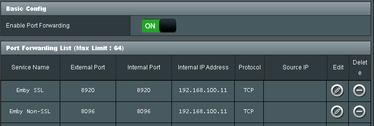
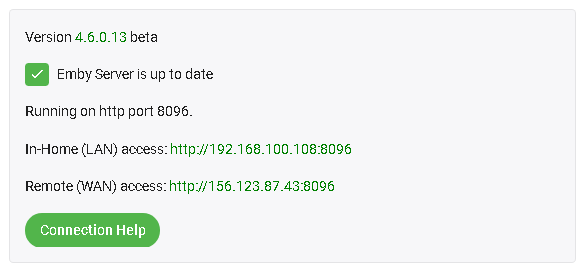

## External Connections

Emby Server allows you to optionally connect outside your home network. Before we begin, make sure you can connect to your Emby Server properly with apps and devices on your local network.
If you have any issues with connections in your network check out local connectivity article.

### Turn on Remote Access

The first step is to enable remote access. You do this from the Server's Network menu by enabling "Allow remote connections to this Emby Server". 

On the same page down below this section you will see these options:

If you have a router that support UPnP and have this turned on you can enable the "Enable automatic port mapping" feature. If you do not see this option please install the Port Mapper Plugin from the plugin catalog.  

> [!NOTE]
> Most routers have the UPnP option turned off by default.

If you turn on automatic port mapping in Emby Server (option shown above) and enable UPnP on your router you likely are done and Emby will work remotely!

> [!NOTE]
> If you just enabled UPnP on your router, please restart Emby Server.

## Setup Port Forwarding

If you're unable to connect after testing the above settings with automatic port mapping, then you may need to setup port forwarding manually with your router to allow external connectivity to your Emby Server.

To do this, turn off the "Enable automatic port forwarding" option just set and open the web interface for your router. You will need to forward TCP Port 8096 on your router to port 8096 on the Emby Server machine. Do the same for port 8920 as well (if using SSL). It is important that the local IP Address for the Emby Server machine does not change. Use the router's DHCP Reservation feature to do that.

The process of doing this will be slightly different for each router model. 

- Here are good step by step guides on how to do this:
  https://portforward.com/dhcp-reservation/#how-to-make-a-dhcp-reservation-in-your-router
  http://www.wikihow.com/Set-Up-Port-Forwarding-on-a-Router

- This Youtube video also explains Port Forwarding pretty well:
  https://www.youtube.com/watch?v=Kp-R-eHiQco

Here is an example router setup showing 2 ports forwarded:

### Locate Your External Address
Your external address is displayed on the front page of the server dashboard, labeled as Remote access. This is the address you should use when away from home.

### Test Your External Address

The easiest way to test your external address, is to open it in a web browser while away from home, or inside your home using a smart phone with the WIFI connection turned off.

> [!IMPORTANT]
> Testing your external address inside your home might not work, and this is OK. Some internet routers disable loopback capabilities (going out and coming back in), therefore you might not be able to test this from inside your home network. It's important that you test away from home, or with your smart phone's wifi connection turned off.

If the external address works in a browser, then you're good to go, and can proceed with connecting from Emby apps.

If this doesn't work continue with how to verify your public IP and port.

### Verify Public IP and Port

To test these open a browser and visit [canyouseeme.org](http://example.com).  
The IP you see listed here must match what Emby shows on the dashboard.  If it doesn't remote access will not work and likely your ISP is using CG-NAT and you are blocked from running services.  In this case visit our forums for assistance.

If the IP address matches the next step is to enter the PORT (8096 or 8920) to test on [canyouseeme.org](http://example.com). If it succeeds your Emby Server should be working remotely.  If this test fails you should re-check the setup mentioned above. If you have any issues please visit our forums for assistance.

If this doesn't work you will want to try completely disabling (turn off) any local malware & firewall software running on the same host temporarily to see if they may be blocking Emby.

If you have a VPN running on the host computer TURN THIS OFF as that may interfere with your Emby Server routing.

You could also be blocked by your ISP in something known as a cgNAT (carrier grade Network Address Translation).  One way of spotting this is to open a command prompt and doing a trace route to 8.8.8.8.

On windows it would be: `tracert 8.8.8.8`

Ignore the first line which will be your own router.  What you want to see is if any of the next 3 or 4 lines start with 10., 192. or 172.  If the first number is a 172 we need to check the second number to see if it's between 16 to 31.  If any of these returned lines matches this you are likely being blocked by your ISP.