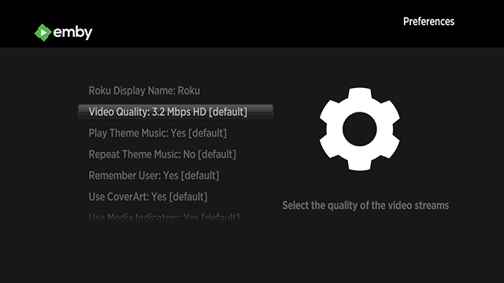

Emby for Roku is available in the [Roku App Store](https://channelstore.roku.com/details/904d20cb3bd4aa340a35aa9c83c9a128/emby).  It is compatible with any Roku model running at least version 7.5 4099 of the Roku firmware.

Emby for Roku can handle just about any type of media thanks to [Emby Server transcoding](Transcoding.md). If you would like to learn how to prepare your media for Direct Play, read below.

# Setup Guide

A setup guide is available in the [Emby Community](http://emby.media/community/index.php?/topic/6763-emby-for-roku/).

# Direct Play Media Formats

* Video — H.264/AVC (.MKV, .MP4, .MOV), on Roku 4 only: H.265/HEVC (.MKV, .MP4, .MOV); VP9 (.MKV)
* Subtitles - SRT and other text-based formats
* Audio – AAC (.MKV, .MP4, .MOV); MP3(.MP3, .MKV); WMA (.ASF, .WMA, .MKV), FLAC (.FLAC, .MKV), PCM (.WAV, .MKV, .MP4, .MOV), AC3/EAC3 (.MKV,.MP4. .MOV, .AC3), DTS (.MKV, .MP4, .MOV), ALAC (.MKV, .MP4, .MOV, .M4A)
* Image — JPG, PNG, GIF (non-animated)

* Multichannel AAC  is not supported on all Roku models. Roku TV’s and Roku 4 set-top-boxes do support multichannel decode to PCM stereo.

* On Roku set-top-boxes Dolby Digital audio (AC3, EAC3) is only supported via pass through.

* DTS is only supported via pass through on both Roku set-top-boxes and Roku TV’s. You must connect your Roku player via HDMI or S/PDIF to a TV or receiver capable of decoding Dolby Digital or DTS in order to hear videos with audio tracks in those formats.

# Best Practices for Direct Play

* Ensure your media meets the above criteria.
* Configure your audio settings in the Roku device control panel. If you'd like DTS audio to passthrough, you'll need to make sure your Roku is configured correctly, or it may trigger transcoding.

* Compare the bitrate of your files to the bitrate setting in the app. You can find the bitrate of a file by checking the media info in the web interface. If the bitrate of a file is higher than the setting in the app, transcoding will be required. Increasing the bitrate setting in the app can help reduce transcoding, but may impact playback performance if your network connection is not fast enough to handle it.

