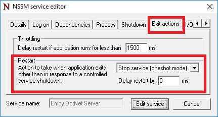

Before setting up a Windows Service, you'll need to [install Emby Server from the Emby website](https://emby.media/download.html).

To setup a Windows Service, we'll be using a program called [NSSM](http://nssm.cc/) that can turn any app into a Windows Service. To begin:

* Download [NSSM](http://nssm.cc/). Make sure to choose the 64-bit or 32-bit version of NSSM to match the architecture of your Windows installation.
* Save nssm.exe to a folder of your choice. You'll need to keep NSSM in this folder in order for the service to function.
* Open a command prompt as admin and "cd" to the folder containing NSSM.
* Type "nssm install" to open the NSSM user interface.

Follow [this guide](http://nssm.cc/usage) to create your Windows Service, but incorporate the following changes:

* **Application path**: path to EmbyServer.exe
* **Startup directory**: folder containing the above executable
* **Arguments**: -service
* **Service name**: Emby Server (or other name of your choice)

Then, on the exit actions tab, make sure to configure the exit action to **not** automatically restart:

This is important because without this, using the **Shutdown** button inside Emby Server will cause NSSM to automatically restart Emby Server.

> [!WARNING]
> Emby will not auto update while running as a service.  To upgrade Emby Server, download the latest version from https://emby.media/windows-server.html. Stop the service and perform the install using the version downloaded. Restart service.