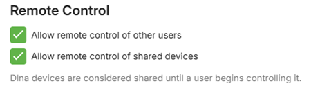
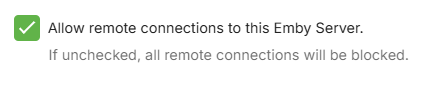
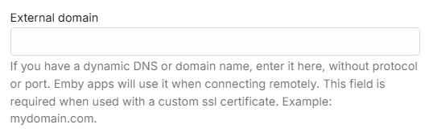

This is a quick tutorial on how to secure your Emby server for free. If you are opening your server to the world, securing it is a good idea. It is also useful to provide required secured streams to external services such as Amazon Alexa, which requires https connections.

## General tips & best practice

Here are some tips to consider.

### Server Admin Account

*   Avoid having a name for the admin user account for Emby Server as admin or root. 

   If the user name is already set as that, you can edit it through the server settings / users screen and editing the profile.

   

*  Separate your admin and normal use of the emby server. Have a separate account for normal use and streaming and keep the account with server admin privilege as a separate account used just for server admin.

   You can control which accounts have the ability to manage the server through this user profile setting

   

*  Consider hiding the admin user account (or any account with server admin privilege) from the list of displayed user accounts for login. When hidden, use the Manual Login option and enter the username an password. The following shows the various options available for hiding a user name

   

*  Consider disabling remote connections for the server admin account. This can be done once the remote connections configuration is in place and working. If there is a need to make changes to the server configuration, use tools such as Team Viewer, Remote Desktop, AnyDesk etc.

   

### User Account Privileges

*  Check all the accounts privileges in the user profiles (Server Settings / [Users](Users.md)) and give the least privileges, ensuring only your server admin account has the privilege to manage the server. 

The following shows the control level you have at the user account level. E.g. remote access can be controlled at the user level.

   

Check that media deletion is controlled and restricted only to the accounts that you trust to give that privilege to. If you had previously granted media deletion for all libraries, reconsider and where absolutely needed, enable it for specific libraries and channels.

   

> [!NOTE]
> You can deselect “All libraries” and select specific libraries and channels.

Similarly for subtitle deletions. 

   

And for remote control, restrict the permission to control for other users to just the admin accounts.

   

You can also disable user accounts 

   

### Remote Connections

*  If the server is only to be used locally, disable remote access at the server level by deselecting this server network setting.

   

> [!NOTE]
> If using a vpn on the local network, you may need to have this allowed, alternatively add the vpn network subnet to the list of LAN Networks in the server [network settings](Hosting-Settings.md).

*  When using a domain name for access to the emby server, consider not having the word “emby” as part of the domain name.

*  Use https secure connections for remote connections. See **Using secure https connections** section below. 

*  When enabled for remote access and not using a reverse proxy, consider changing the default public port numbers from 8096 and 8920 to other port numbers.

   

   

The public ports would need to be mapped to the local ports. This can be done either by using the automatic port mapping functionality of the Emby Server or by setting up port forwards manually in the router. See [Automatic Port Mapping](Connectivity.md#automatic-port-mapping) and [Setup Port Forwarding](Connectivity.md#setup-port-forwarding).

*  You also have the option to restrict remote connections to only be allowed from specific public/WAN IP addresses or subnets. The reverse is also possible, blocking specific remote IP addresses and/or subnets. The default is that all remote addresses would be allowed.

## Using secure https connections

You'll need two things:
* A domain that supports TXT records
* A ssl certificate (PKCS #12)

### Get your domain
Sign up for a free domain of your choice. You could use [Freenom](https://my.freenom.com/) or [Dynu](https://www.dynu.com/en-US/).

### SSL certificate
We will now create Let's encrypt ssl certificates and add it to your domain. Here is a free service to help with this [SSL for free](https://www.sslforfree.com/).
1. Enter your domain on the site. i.e. yourdomain.com and create a free SSL certificate
2. Select Manual Verification (DNS) > Manually verify domain. We now have 2 TXT records (step 2 on the SSL for free website). We will copy back the TXT records to the domain provider. Leave the SSL for free page open. We will come back to it.

3. On the domain provider website, select your domain > Manage DNS. Let's create a new TX record. Repeat the steps for both TXT records on SSL for free. Your information should look like this.

   **Name**: _acme-challenge.{yourdomain.com}

   **Type**: TXT.

   **TTL**: 300 (if you can set it to 1, go for it).

   **Target**: qariKbGVafpb5MespqHdMaGi933yW-Z2A3shE0wIyZA

4. You'll notice Type A records in the same section. You can remove the WWW entry. Ensure your external IP is correct. If you have a dynamic IP, you'll need to keep this updated when it changes.
5. Wait about 15 minutes. Let the domain name and changes propagate.
6. Back to the SSL for free website. Look at step 3, you'll see a link or two to click. Click them. If it is successful, go ahead and click Download SSL certificate. If it is not successful, wait a little longer and retry.

### Setup Emby with your domain and SSL certificate
Now you should have a domain and a folder of ssl certificate (ca_bundle.crt, certificate.crt, private.key).
We are almost done. Your Emby server requires a PKCS #12 certificate (certificate.crt and private.key combined).

1. Use this [online certificate converter](https://www.sslshopper.com/ssl-converter.html).
2. Select type to convert to: PKCS #12. This should expand the number of fields. Once completed, you'll get a new .pfx certificate.

   **Certificate file**: certificate.crt

   **Private key**: private.key

   **Chain certificate**: The ca_bundle.crt or you can also find it here, Let's Encrypt [Intermediate certificate](https://letsencrypt.org/certs/lets-encrypt-x3-cross-signed.pem.txt). Save the text into a .txt file.

   **PFX password**: Since the private key is combined with the certificate, set a password to secure the new ssl certificate. Remember this password, you'll need it in Emby.
3. Go to your Emby server dashboard > Network. Save your changes and restart your server.

   

   

   **External domain**: yourdomain.com

   **Custom SSL certificate path**: point to your new certificate.pfx file

   **Certificate password**: The password you set up in the previous step.

   **Secure connection mode**: Set it to Preferred but not required or Required for all remote connections.

Your dashboard should now reflect your remote access as https://yourdomain.com:port. If you followed all the steps, clicking the new remote url should reach your Emby server. If it doesn't work, verify your https ports and try connecting from outside of your network. If the dashboard is still showing the domain url with http, check that you have entered the correct certificate password. You may need to look at the server logs to see if there was an error in processing the certificate.

**Save all your certificate files and keys in safe location.** You'll need the private key when you are ready to renew your SSL certificate (I have my own CSR option on SSL for free).
Since this is all for free, it requires a bit more involvement. You will need to ensure you renew your SSL certificates (every 3 months with SSL for free) and your free domain (every year at least). If you used SSL for free, I suggest creating an account to make the renewal process easier.

If you are interested in an even more secure setup, here is a community-written guide on [HOW TO: NGINX Reverse Proxy](https://emby.media/community/index.php?/topic/47508-how-to-nginx-reverse-proxy/).
