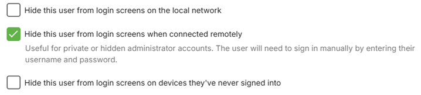

This is a quick tutorial on how to secure your Emby server for free. If you are opening your server to the world, securing it is a good idea. It is also useful to provide required secured streams to external services such as Amazon Alexa, which requires https connections.

## General tips & best practice

Here are some tips to consider.

### Server Admin Account

*   Avoid having a name for the admin user account for Emby Server as admin or root. 

   If the user name is already set as that, you can edit it through the server settings / users screen and editing the profile.

   


*  Separate your admin and normal use of the emby server. Have a separate account for normal use and streaming and keep the account with server admin privilege as a separate account used just for server admin.

   You can control which accounts have the ability to manage the server through this user profile setting

   


*  Consider hiding the admin user account (or any account with server admin privilege) from the list of displayed user accounts for login. When hidden, use the Manual Login option and enter the username an password. The following shows the various options available for hiding a user name

   


*  Consider disabling remote connections for the server admin account. This can be done once the remote connections configuration is in place and working. If there is a need to make changes to the server configuration, use tools such as Team Viewer, Remote Desktop, AnyDesk etc.

   


### User Account Passwords

*  Ensure all user accounts have passwords set on the server, including user accounts linked to an [Emby Connect](Emby-Connect.md) username.


### User Account Privileges

*  Check all the accounts privileges in the user profiles (Server Settings / [Users](Users.md)) and give the least privileges, ensuring only your server admin account has the privilege to manage the server. 

The following shows the control level you have at the user account level. E.g. remote access can be controlled at the user level.

   

Check that media deletion is controlled and restricted only to the accounts that you trust to give that privilege to. If you had previously granted media deletion for all libraries, reconsider and where absolutely needed, enable it for specific libraries and channels.

   

> [!NOTE]
> You can deselect “All libraries” and select specific libraries and channels.

Similarly for subtitle deletions. 

   

And for remote control, restrict the permission to control for other users to just the admin accounts.

   

You can also disable user accounts 

   


### Remote Connections

*  If the server is only to be used locally, disable remote access at the server level by deselecting this server network setting.

   

> [!NOTE]
> If using a vpn on the local network, you may need to have this allowed, alternatively add the vpn network subnet to the list of LAN Networks in the server [network settings](Hosting-Settings.md).


*  When using a domain name for access to the emby server, consider not having the word “emby” as part of the domain name.


*  Use https secure connections for remote connections. See **Using secure https connections** section below. 


*  When enabled for remote access and not using a reverse proxy, consider changing the default public port numbers from 8096 and 8920 to other port numbers.

   

   

The public ports would need to be mapped to the local ports. This can be done either by using the automatic port mapping functionality of the Emby Server or by setting up port forwards manually in the router. See [Automatic Port Mapping](Connectivity.md#automatic-port-mapping) and [Setup Port Forwarding](Connectivity.md#setup-port-forwarding).


*  You also have the option to restrict remote connections to only be allowed from specific public/WAN IP addresses or subnets. The reverse is also possible, blocking specific remote IP addresses and/or subnets. The default is that all remote addresses would be allowed.


## Using secure https connections

You'll need two things:
* A domain that supports TXT records
* A ssl certificate (PKCS #12)

### Get your domain
Sign up for a free domain of your choice. You could use [Dynu](https://www.dynu.com/) which is what will be covered in the instructions below. Alternatively use a paid-for registered domain name.

> [!Note]
> For the SSL certificate setup, you will need to edit the DNS record for verification of the domain and **Dynu** no longer allow creation of TXT DNS records in the first 30 days after setting up a new domain. This restriction may be only for updates through the Dynu DDNS Service Control Panel and it may be possible to make early changes through api using 3rd party products. Otherwise, wait 30 days after creating the domain before getting and adding the ssl certificate.

1. Create an account with https://dynu.com

3. Login to your account and open the Control Panel


3. Select "**DDNS Services**"

4. Click on "**+Add**" to add a domain to the Dynamic DNS Service. 


Next, either choose a free domain name provided by **Dynu**, selecting one of the many Top Level domain names with your hostname as the prefix, or adding a domain you already own.


The following shows examples of available Top Level domain names for a free domain name provided by Dynu.


5. If adding a free domain from Dynu, select your preferred Top Level domain and enter the prefix "Host" name you wish to have.

6. For **Dynu** free domains, you will now need to wait 30 days before you can add DNS TXT record for verification for the SSL certificate as detailed in the next section.

### SSL certificate

Two sources for ssl certificates will be covered here, [SSL for free](https://www.sslforfree.com/) which is now part of [ZeroSSL](https://zerossl.com) and [Let's Encrypt](https://letsencrypt.org/). There are pros and cons for both.

"SSL for Free" following the merge into "ZeroSSL" is no longer available free after the first 90-day certificate and you would need to switch to a paid-for-plan. Whereas "Let's Encrypt" provides free certificates without any time limit, but requiring renewal every 90 days.

"Let's Encrypt" certificates, however, may have compatibility issues with LG and Samsung Smart TVs, issues which are known not to arise currently with ZeroSSL certificates.

### SSL for Free / ZeroSSL certificate

Go to the web site through either [SSL for free](https://www.sslforfree.com/) or [ZeroSSL](https://zerossl.com) and register and login to your account.

1. Enter your domain on the site. i.e. yourdomain.com and create a free SSL certificate

2. Select Manual Verification (DNS) > Manually verify domain. We now have 2 TXT records (step 2 on the SSL for free website). We will copy back the TXT records to the domain provider. Leave the SSL for free page open. We will come back to it.


3. On the domain provider website, select your domain > Manage DNS. Let's create a new TX record. Repeat the steps for both TXT records on SSL for free. Your information should look like this.

For Dynu DNS, login and open the Control Panel and select DDNS Services, then select the domain from the list of domains for your account, and click on **DNS Records** and then fill the template for Adding a DNS Record. In the **Node Name** field replace the preset "www" with `_acme-challenge`. For the **type** field, open the drop-down and select **"TXT - text"**. In the **"Text"** field, you would enter the text character requested for the certificate domain verification process.

You should end up with a TXT DNS Record like this - these are just examples:

   **Name**: _acme-challenge.{yourdomain.com}

   **Type**: TXT.

   **TTL**: 300 (if you can set it to the lowest possible value).

   **Target**: qariKbGVafpb5MespqHdMaGi933yW-Z2A3shE0wIyZA

4. You'll notice Type A records in the same section. You can remove the WWW entry. Ensure your external IP is correct. If you have a dynamic IP, you'll need to keep this updated when it changes.

5. Wait about 15 minutes. Let the domain name and changes propagate.

6. Back to the **SSL for free** / **ZeroSSL** website. Look at step 3, you'll see a link or two to click. Click them. If it is successful, go ahead and click Download SSL certificate. If it is not successful, wait a little longer and retry.

7. After the certificate is created, you should be able to remove the TXT DNS records for the domain

Now you should have a domain and a folder of ssl certificate (ca_bundle.crt, certificate.crt, private.key).

We are almost done. Your Emby server requires a PKCS #12 certificate (certificate.crt and private.key combined).

8. You now need to create the PKCS #12 pfx certificate to use with Emby Server. Use this [online certificate converter](https://www.sslshopper.com/ssl-converter.html).

9. Select type to convert to: PKCS #12. This should expand the number of fields. Once completed, you'll get a new .pfx certificate.

   **Certificate file**: certificate.crt

   **Private key**: private.key

   **Chain certificate**: The ca_bundle.crt or you can also find it here, Let's Encrypt [Intermediate certificate](https://letsencrypt.org/certs/lets-encrypt-x3-cross-signed.pem.txt). Save the text into a .txt file.

   **PFX password**: Since the private key is combined with the certificate, set a password to secure the new ssl certificate. Remember this password, you'll need it in Emby.

10. Copy the pfx file to where you want to keep the Emby Server certificate and you will also need the pfx password. Next go to the following section below: **Setup Emby Server with your domain and SSL certificate**


### Let's Encrypt certificate

For certificates provided by **Let's Encrypt**, you will need to select an Acme Client application that would interact with the **Let's Encrypt** servers. See [ACME Client Implementations](https://letsencrypt.org/docs/client-options/) for the list of available Acme clients.

The instructions given below are for the [Posh-ACME](https://poshac.me/) Powershell Acme client for Windows. Powershell should be available for MacOS and Linux as well. The sequence of steps should be similar whichever Acme client is used. The method that is documented here requires the addition of a TXT DNS Record to the DDNS Service DNS records for your domain.

> [!Tip]
> Whilst the instructions here cover the manual insertion of a DNS record for verification, the [Posh-Acme](https://poshac.me/) product does have many plugins, including one for **Dynu** that can be used for automating the creation of the certificate and verification of the domain ownership. You can explore these features and try out with the staging test servers of **Let's Encrypt**. See [Posh-ACME DNS Plugins](https://poshac.me/docs/v4/Plugins/) and [Posh-ACME Tutorial](https://poshac.me/docs/v4/Tutorial/).

> [!Note]
> If you have just created a free domain with [Dynu](https://www.dynu.com/), you will need to wait 30 days before you can proceed with the following steps. You may find that the use of API and the plugins mentioned in the above tip, gets round this restriction.

The following instructions are for the windows platform. Powershell should be available for other platforms as well.

Start a PowerShell session running as administrator.

Install the Posh-Acme package
```
Install-Module -Name Posh-ACME -Scope CurrentUser
```
Answer "Y" to trust the install.

You may need to add the PowerShell Gallery if not already available.

You may need to change the PowerShell execution policy to import the Posh-Acme module, through these PowerShell commands:
```
Set-ExecutionPolicy RemoteSigned -Scope CurrentUser -Force
Import-Module Posh-ACME
```
Let's Encrypt have two sets of server platforms, a staging one for testing purposes and the production set.

Execute the following Powershell command to select the Production environment.
```
Set-PAServer LE_PROD
```
(If you wish to experiment with the staging test environment, run this command `Set-PAServer LE_STAGE`)

You will be shown a link to the Terms of Service, follow the link to read the terms.

You are now ready to request the certificate. 

Select a password to use with the pfx certificate to be configured in the Emby Server Network Settings. This will need to be passed on in the new certificate request.

You should also include a contact e-mail address in the request which is expected to result in a reminder for renewal.

Run the following PowerShell command to request the certificate for your domain.

```
New-PACertificate <your domain> -AcceptTOS -PfxPass <the-password to be set on the pfx certificate> -Contact '<your e-mail address>' -Verbose -Force
```

The additional parameters being:

`-AcceptTOS` : To accept the Terms of Service.

`-Verbose` : could be useful in event of issues.

`-Force` : allows you to re-create the certificate.


Example:
```
New-PACertificate my.domain.org -AcceptTOS -PfxPass gTsjAd!02 -Contact 'my-email@mail-provider.com' -Verbose -Force
```
You would then get the TXT record to add your domain DNS Records for the DDNS service.

Exmaple of response from Posh-Acme:
```
Please create the following TXT records:
------------------------------------------
_acme-challenge.<your domain> -> xxxxxxxxxxxxxxxxxxxxxxxxxxxxxxx
------------------------------------------

Press any key to continue.:
```
where xxxxxxxxxxxxxxxxxxxxxxxxxxxxxxx would be the TXT string displayed by Posh-Acme that needs to be in the TXT DNS record.

Now login your DDNS service provider, eg [https://www.dynu.com](https://www.dynu.com/) and click on the **Control Panel** button.

Click on "DDNS Service"

Click on your domain name

and now click on "DNS Records"

You will see a number of DNS records of Type A and AAAA. You will also see a public IP Address. Check that this is your WAN/Public IP Address.

You now need to add a DNS Record.

In the Node Name field, overwrite the preset "www" with "_acme-challenge"
In the Type field, select "TXT - Text" from the drop-down
In the Text field, paste in the text characters returned by Posh-Acme above.
Now click on "+Add DNS Record"


You should now see a new DNS record added with the name "_acme-challenge.your-domain-name"


Now go back to the Powershell session and hit enter to continue.

Posh-Acme will now sleep for 2 minutes and then auto connect to your DDNS provider and validate the DNS entry and confirm ownership of the domain through that.

When validated, Posh-Acme will now request that you remove this DNS record and it will confirm the certificate creation.


Go back to the DDNS service DNS Records page for your domain, and for the `_acme-challenge.your-domain` DNS record, click on the recycle bin icon and confirm the deletion.

To see where the certificate files are stored by Posh-Acme, go back to the Powershell session and enter the following command:
```
Get-PACertificate | fl
```


The file that you will need for Emby Server is that in the path for "PfxFile".
Copy the file for where you want to keep the Emby Server certificate and you will also need the password you specified on the `New-PACertificate` command.

Now proceed with the following section to add the domain and certificate to the Emby Server Network settings.

### Setup Emby Server with your domain and SSL certificate

Go to your Emby server Settings dashboard > Network. 

The following will be the fields you will need to specify:

   

   

where: 
   **External domain**: yourdomain.com

   **Custom SSL certificate path**: point to your new certificate.pfx file

   **Certificate password**: The pfx password you set up in the previous step.

   **Secure connection mode**: Set it to either "**Preferred but not required**" or "**Required for all remote connections**".

Your Emby Server Settings dashboard should now reflect your remote access through this url `https://yourdomain:port`.

If you followed all the steps, then navigating a browser from outside your local network to this new remote url should reach your Emby server. 

If it doesn't work, verify your https ports and try connecting from outside of your network. If the dashboard is still showing the domain url with http, check that you have entered the correct certificate password. You may need to look at the server logs to see if there was an error in processing the certificate.

> [!Note]
> The test needs to be made from outside your local network as connections into your public WAN IP address from within the local network are normally blocked. 

**Save all your certificate files and keys in safe location.** You'll need the private key when you are ready to renew your SSL certificate.

> [!Tip]
> If you are interested in an even more secure setup, here is a community-written guide on [HOW TO: NGINX Reverse Proxy](https://emby.media/community/index.php?/topic/47508-how-to-nginx-reverse-proxy/).
