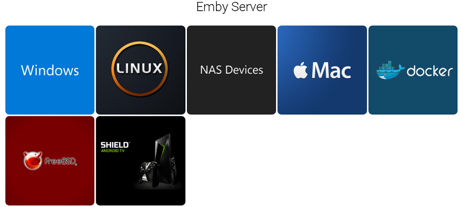
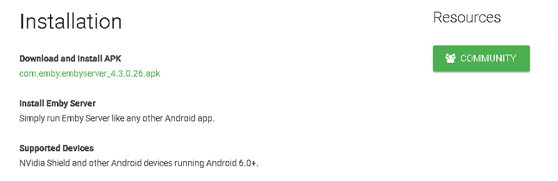
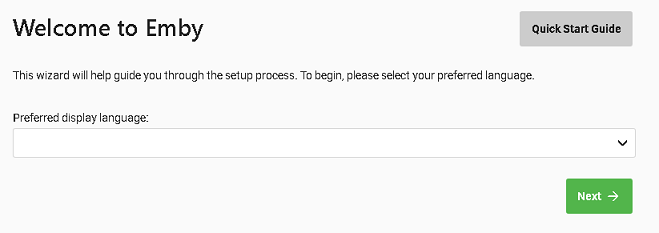

There are several manual steps that need to be completed to install Emby Server on the Shield TV.

## Step 1 Determine the Shield TV IP Address

- From the Shield TV home screen navigate top right to the settings icon next to the clock. 

- Enter settings

- Scroll down to "Network & Internet" and enter this option

- It should show you Shield TV connected and it will give you the IP address.

- Write down this IP address as you will need it later.

## Step 2 Determine the current APK link.

On a PC go to https://emby.media/download.html and you will see:

Click the Shield Android TV option and you will get a screen similar to:

Note the file numbers in the above link which is "4.3.0.26" which we will need in a following step.

> [!Note]
> This "4.3.0.26" number is just an example and not the actual version number to use.

## Step 3 Install Downloader
- On the Shield TV run the Google Play Store Apps,

- Search for "Downloader by TROYPOINT".

- Install this app and then run it.

- If the app asks for permission to access the system, please grant it permission.

## Step 4: Downloading the APK
On the Home screen in "Downloader by TROYPOINT" you will see an input box for  download location.

Type in:

https://github.com/MediaBrowser/Emby.Releases/releases/download/4.3.0.26/com.emby.embyserver_4.3.0.26.apk

> [!IMPORTANT]
> Adjust the release numbers in the link to match the version of the current release file showing on the website from step 1.

If the app asks for permission to access the system, please grant it permission.

## Step 5: Installing Emby Server

- After the download completes you will have the option to install the app.  Please do so.

- If you don't get this option or later want to reinstall the app you can use the FILE menu on the left to quickly find and launch/install it.

- After launching the APK file you will be prompted with a screen asking:

    "Do you want to install this application? It does not require any special access."

- Please select INSTALL to continue.

After installation is complete you will have an option of DONE or OPEN.  Please select OPEN:

The Shield TV will now prompt you to provide it permission to access the system.  Please ALLOW it.

The application will now provide you a URL to use to access the server.  We will NOT USE this address so ignore it.

## Step 6: Accessing the Shield TV from a PC

- From a PC you will now connect to the Emby Server running on the Shield TV.

- Enter `http://`

- Type in the IP address from Step 1

- Add a colon followed by 8096

The URL entered on your PC will then look similar to:

`http://192.168.0.14:8096`

## Step 7: Configuration and Setup

You should now have a screen that looks like this:

Congratulations, you have successfully installed Emby Server and are now ready to configure it like any other Emby Server from a PC.  Please continue following the normal installation procedure from here.

## Step 8: Optional - Using USB Attached Storage

If using USB attached storage on the Shield TV you may wish to read this Nvidia article on write access.

https://nvidia.custhelp.com/app/answers/detail/a_id/4437/~/how-to-write-to-usb-shared-storage-on-shield