There are several manual steps that need to be completed to install Emby Server on the Shield TV.

## Step 1 Install Downloader
- On the Shield TV, open the **Google Play Store** App,

- Search for "Downloader by AFTVnews".

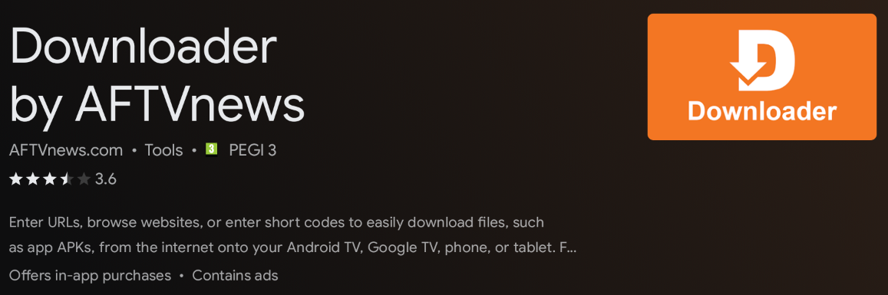

- Install the Downloader app.

## Step 2 Allow external installs

- On the Shield TV, open **Settings**, Select **Apps** and scroll down and select **Security & restrictions**. Now click on **Unknown sources** and Allow **Downloader** to **Install unknown apps**.

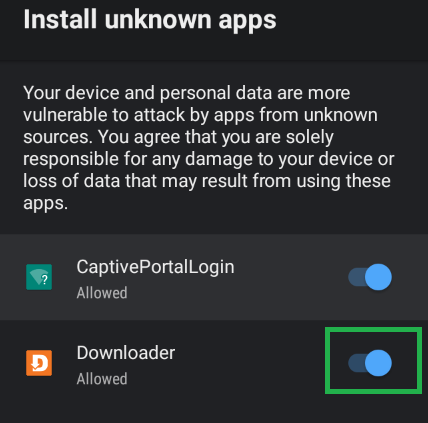

## Step 3 Open the Downloader app

- On the Shield TV, open the **Downloader** app and select the **Browser** option in the sidebar. Clear the default url and enter the following url https://emby.media/download

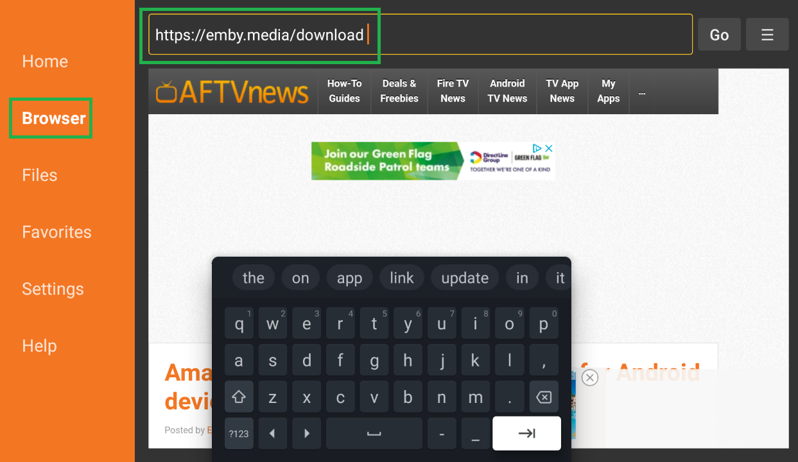

- Click on the **Go** button to open the emby download page

- Scroll down the **Emby Server** section and double click on the **NVIDIA Shield** option

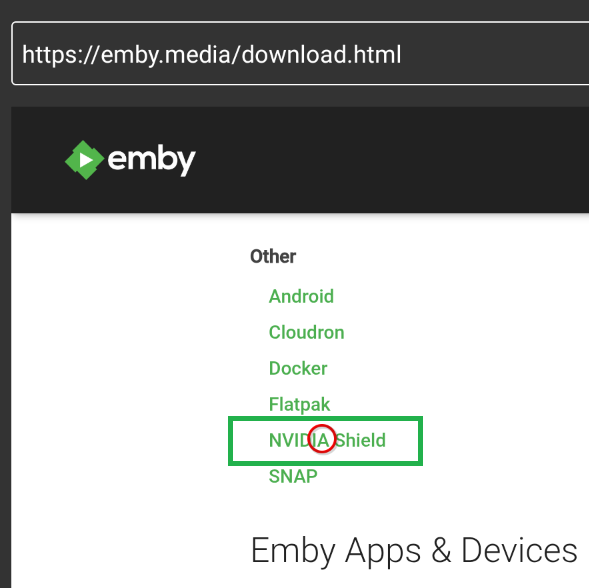

- You will now see the **Emby Server for Android** downloads page

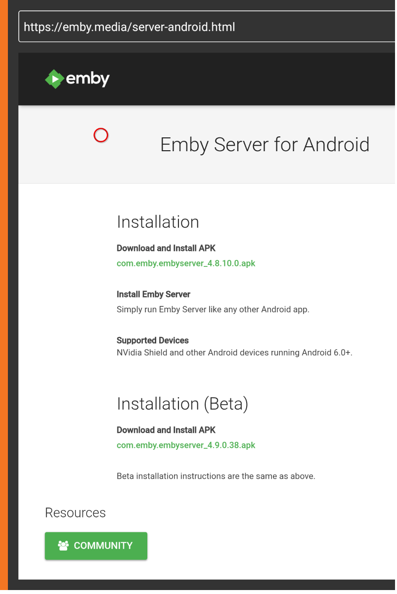

## Step 4 Optional - Save the page as Favorite

- Click on the Menu button on the top right corner and select the **Add current page to favorites** option

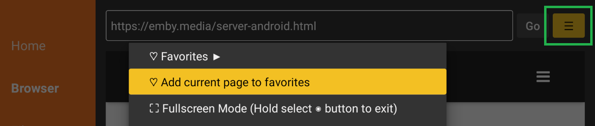

- Save as a favorite

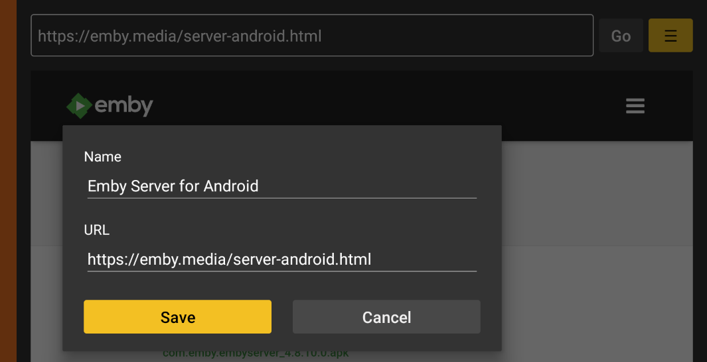

- The apks download page is now in Favorites

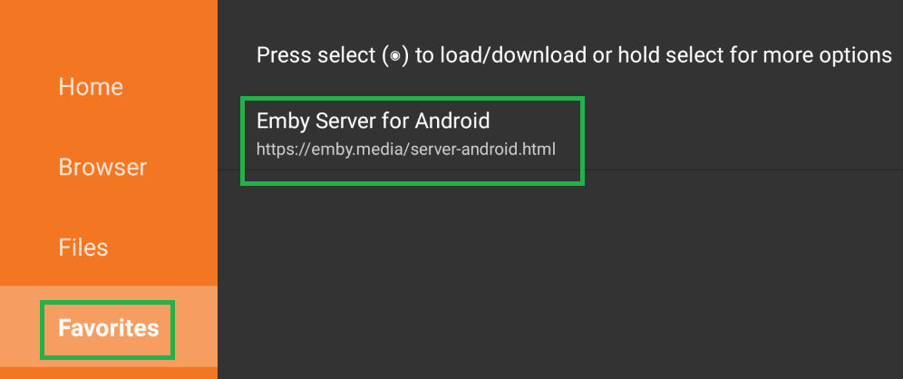

## Step 5 Installing Emby Server

- Select and double Click on the apk to install

- The download will start

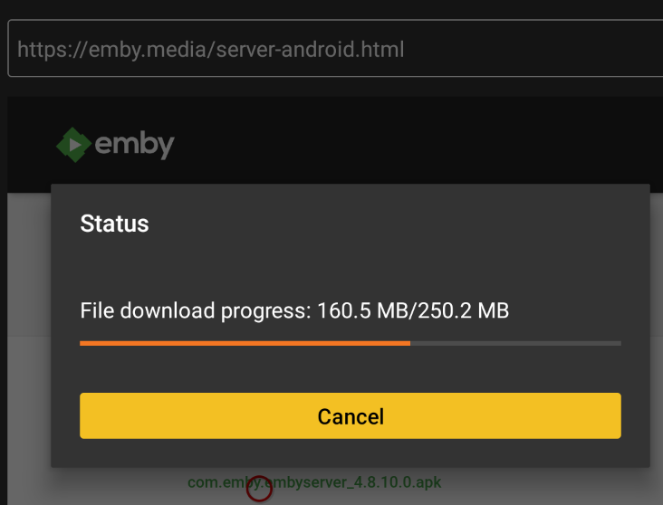

- After the download completes, you will have the option to install the app.  Please do so.

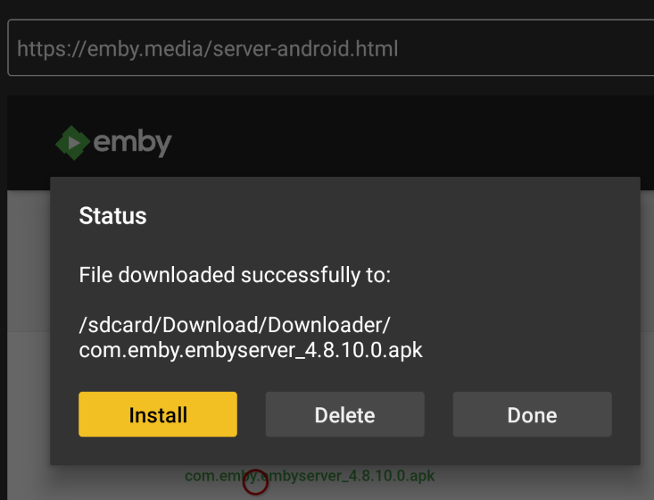

- If you don't get this option or later want to reinstall the app, you can use the **Files** menu on the left to quickly find and launch/install it.

- After launching the APK file you will be prompted with a screen asking:

  "Do you want to install this application?" 

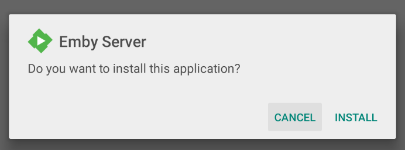

- Please select INSTALL to continue.
  
- The install will now start. You may get a prompt from **Google Play Protect** that the install has been blocked. Select **More details** and **Install anyway**. 

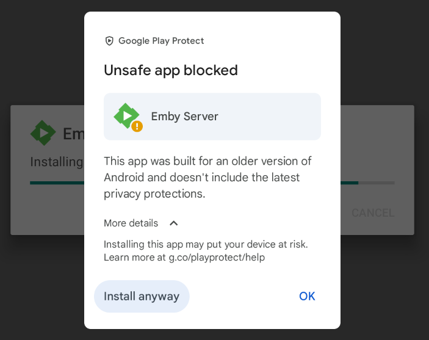

- The install should now complete.

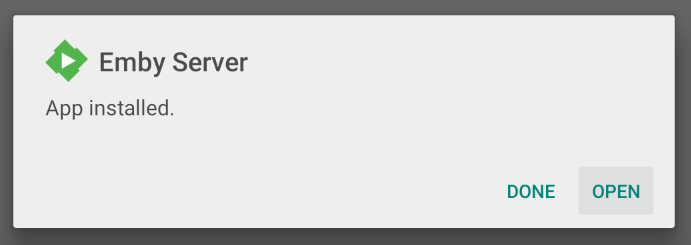

## Step 6 Launching Emby Server

- Select the **OPEN** button on the **App installed** dialogue box.

- If the app asks for permission to access the system, please select **Allow** to grant the permission.

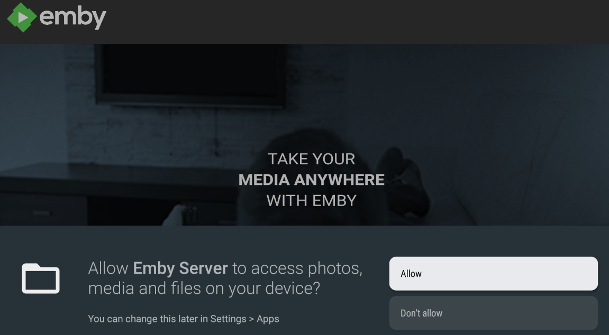

- Emby Server will now start and will show the url to use to access the server from devices and PCs on the local network. Note down this url as it will be needed for connecting to the server to configure the server.

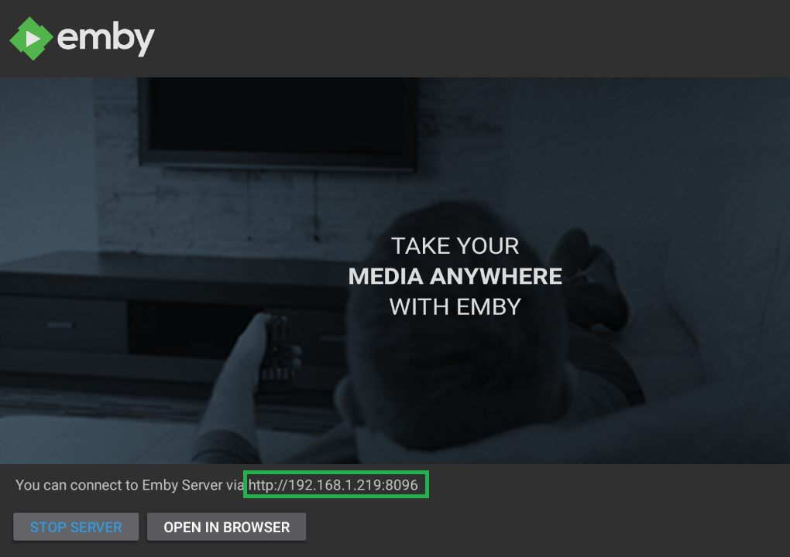

> [!NOTE]
> If the link does not work, you can check that the IP Address is correct for the NVIDIA Shield by opening **Settings** and selecting **Network & Internet** to view the IP address. See [Connecting from Client Apps](Connectivity.md) for troubleshooting tips.

- At any time, you can view this screen by clicking on the Emby Server icon within your NVIDIA Shield installed apps.

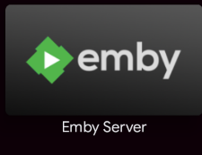

## Step 7: Accessing the Shield TV from a PC

- From a PC you will now connect to the Emby Server running on the Shield TV.

- Enter the url shown on the screen, example: 

           `http://192.168.1.219:8096`

- It is advisable that you make this NVIDIA Shield IP Address a static / DHCP Reserved IP address. For more information see [Connecting from Client Apps](Connectivity.md).

## Step 8: Configuration and Setup

You should now have a screen that looks like this:

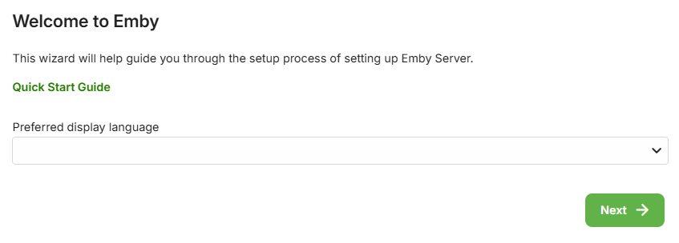

Congratulations, you have successfully installed Emby Server and are now ready to configure it like any other Emby Server from a PC.  Please continue following the normal installation procedure from here.

## Step 9: Optional - Using USB Attached Storage

If using USB attached storage on the Shield TV you may wish to read this Nvidia article on write access.

https://nvidia.custhelp.com/app/answers/detail/a_id/4437/~/how-to-write-to-usb-shared-storage-on-shield