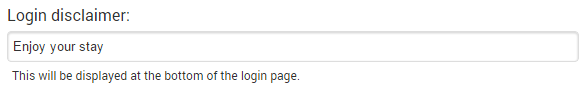
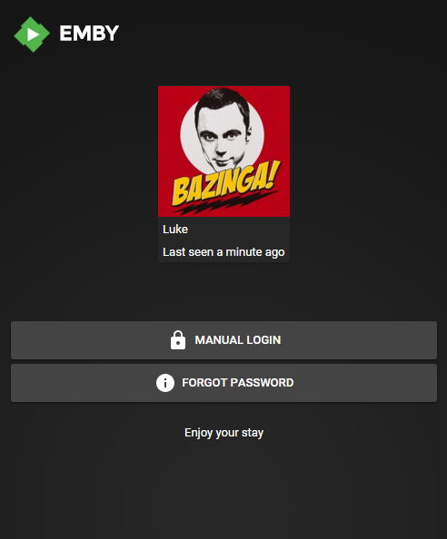

The server has several settings that can be used to customize how it presents itself to users.

- **Friendly server name**: used to set a custom name for your server. This name will be displayed within Emby apps. If no friendly name is set, the computer name will be used instead.

- **Preferred display language**: used to set the language for the server's web interface. 

## Advanced settings

- **Cache path**: set a custom cache path if you do not want the cache to be located in the server's default app data directory.

## Branding

The **Login disclaimer** can be used to display a custom message on the login screen of the web client.

