Access to the Server Settings is through the cogwheel icon appearing at the top right corner of the Home screen.

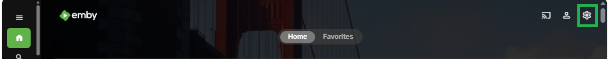

The server has several settings that can be used to customize how it presents itself to users. These specific settings can be found in the **Dashboard** and **General** settings groups in the left sidebar as shown below.

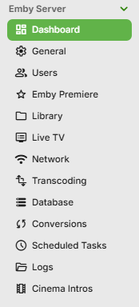

## Dashboard

The dashboard screen gives you the server access url(s), version number, whether you have an [Emby Premiere](Emby-Premiere.md) subscription, a list of recent alerts and activities and the ability to set a name for the Emby Server and shutdown and restart.

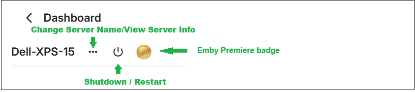

### Emby Server Friendly Name

**Friendly server name**: used to set a custom name for your server. This name will be displayed within Emby apps. If no friendly name is set, the computer name will be used instead.

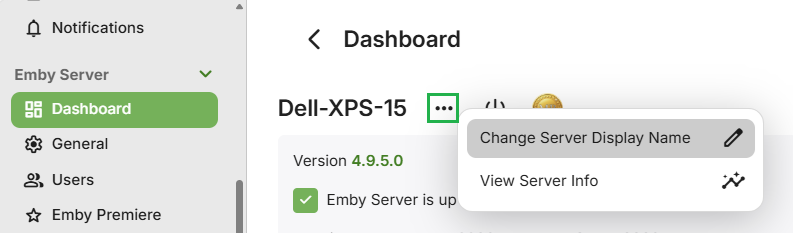

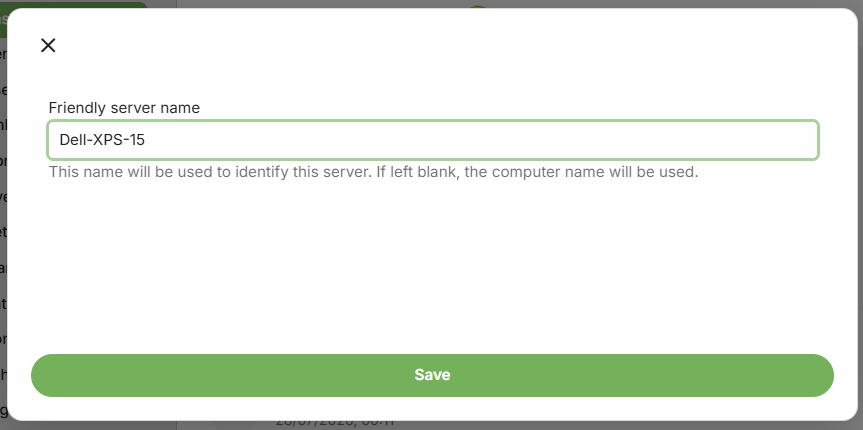

### Emby Server Folder Paths Information

The Emby Server Folder Paths Information can be displayed through the "View Server Info" button.

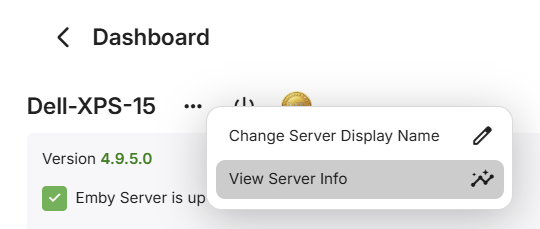

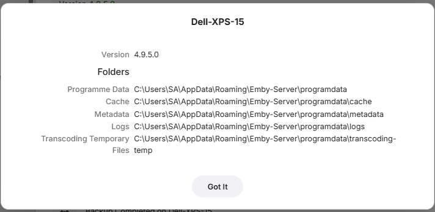

### Emby Server Shutdown and Restart

You can shutdown Emby Server using the Dashboard shutdown/restart button.

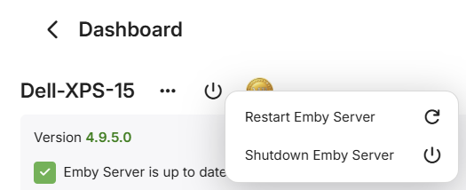

The "**Restart**" button may not be available, e.g. when running Emby Server as a Service on Windows where restart needs to be through the Windows Services management interface.

### Emby Server Access URL(s)

The LAN and WAN access urls and server version are displayed on the Dashboard.

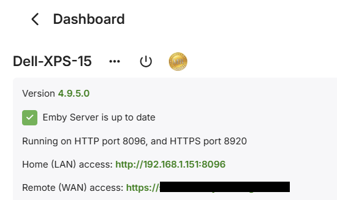

### Alerts

Recent alerts can be seen on the dashboard.

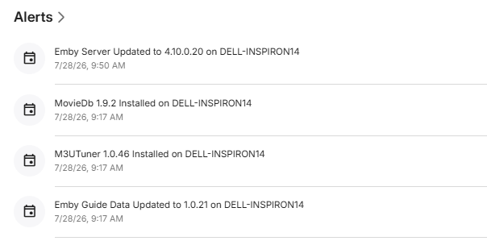

### Activity

Recent activity can be seen on the dashboard.

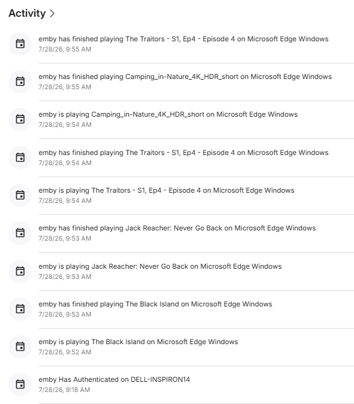

##  General

The **Preferred display language** is used to set the language for the server's web interface.

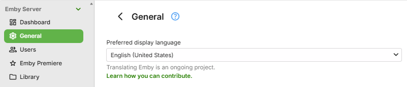

### Advanced setting

**Cache path**: set a custom cache path if you do not want the cache to be located in the server's default app data directory.

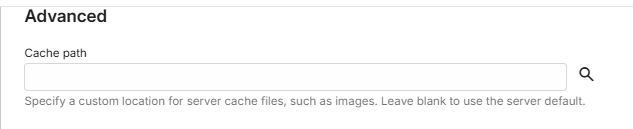

### Branding

The **Login disclaimer** can be used to display a custom message on the login screen of the web client.

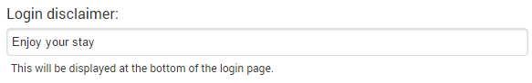

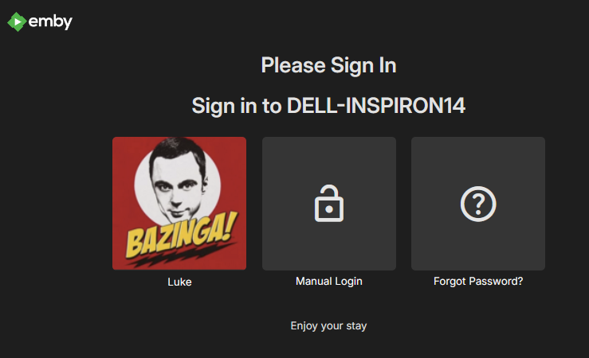

You can also add a Custom css for the web interface.

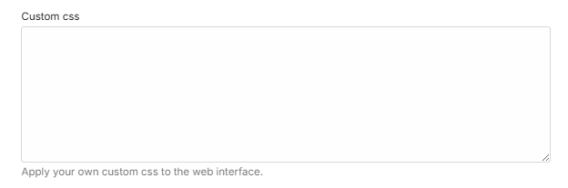

### Maintenance Mode

A **General** settings option is available to allow you to indicate to users that the server is not available and is undergoing maintenance. 

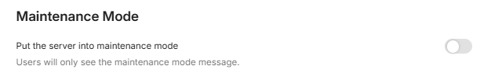

### Auto Updates and Launch settings

There are a number of settings to control auto updates to the Emby Server and plugins and if the Emby Server should auto restart after plugin updates. There is also a setting for auto launch of Emby Web when the Emby Server is launched. When enabled, this would launch the default browser and access the Emby Server local url.

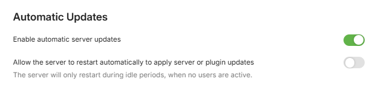

> [!NOTE]
> Auto Updates are not available on all platforms.

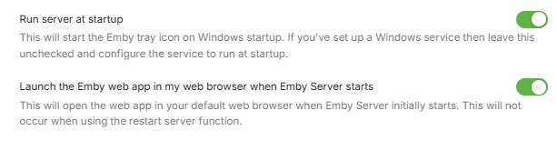
