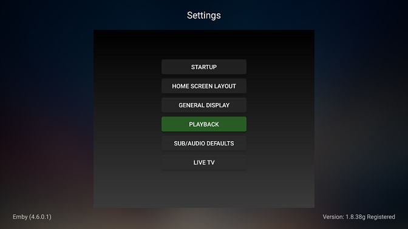
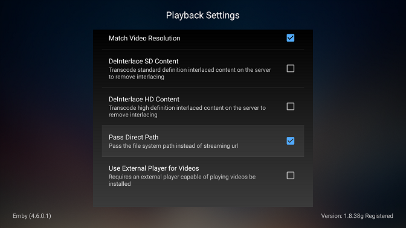
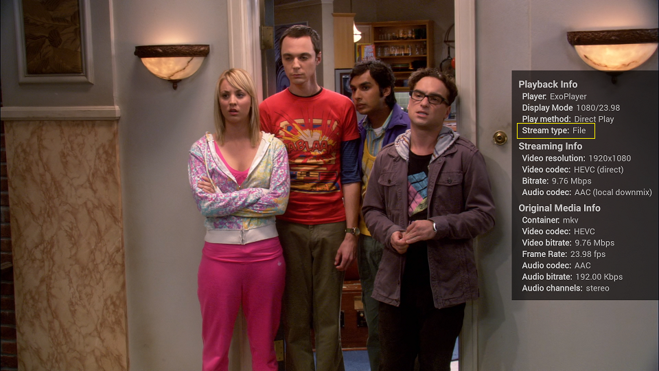

> [!NOTE]
> If on Android 11+ this option is now only available for external players.

In order to setup direct file access on Android TV for Emby you will first need to setup shares and UNC access of your libraries which is covered in Optional Network Paths.

Next you will need to setup Android TV Storage Attachment so that you device will be able to access your media files.

In order to use Direct File Access on your Android TV you will need to make sure you are running Version 1.8.36G or later. You can find your version in Emby by clicking on the setting icon top right then looking at the version on the next screen on the right side at the bottom.

From the settings screen above click on the Playback

You will now want to enable Pass Direct Path option (should be checked).

Once you've performed these steps you should be able to see Emby access your files directly in Stats for Nerds.

