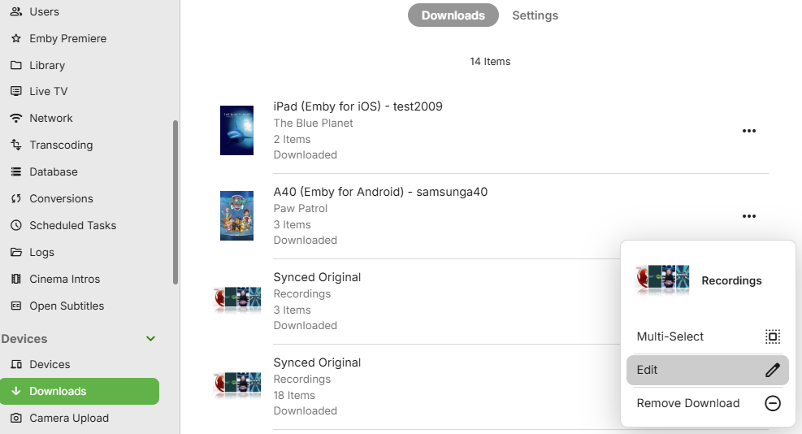

Download jobs can be for an individual media file download or a whole TV season or show and also possible to download a complete library. Download jobs also include those created for the [Folder Sync](Folder-Sync.md) feature.

Download jobs are created through the **Download** button within the Emby Apps that support downloads and also within context menu **Download to...** button which is available for media libraries contents. The **Download to...** button is also available in the [Emby Web client](Web-Client.md) app. For the various options available, see the [Download Options](Sync.md) article.

## Downloads Job Settings

When creating sync jobs, you'll be able to configure various settings for the job. The settings that are available will differ depending on the content being synced. See [Download Options](Sync.md) for details. The following lists the various options available.

Some of the settings available are:

**Quality**

The desired quality level of the synced content. Higher produces better video quality but will require more storage space on the mobile device. The "Original" option can be used to force the process to utilize the original file, but this may result in the file not being playable on the device.

**Profile**

On some Emby client apps, an option is provided to select a pre-set download profile, as well as the option of having a custom profile.

**Unwatched Videos Only**

Only unwatched videos will be downloaded or copied, and videos will be removed from the device as they are watched.

**Automatically Download New Content**

New content added to the folder or category will be automatically synced to the device.

**Item Limit**

The maximum number of items that will be downloaded to the device at any given time.

## Subtitles

All available text-based subtitles are included with download jobs, allowing you to enjoy subtitle selection even when offline.

## Managing Download Jobs

Individual users can manage their own download jobs by opening up the Downloads screen by selecting Downloads within the App Settings or within the Devices section on Emby Web Settings. 

and for Emby Web

On selecting that screen and the **Manage Downloads** button, the list of download jobs will show

Selecting the download job will show the download options and list of items and status

and similarly the view of download jobs on Emby Web when opening the Downloads tab

and clicking on the **...** button, the download job can be modified

It is also possible to remove a download 

## Cancelling Download Jobs

To cancel a download job, simply click the dot menu next to a job and then select the **Remove Download** option. This will delete the download job as well as all files that have been copied as part of this job.

Alternatively it's also possible to cancel individual items within a job by opening the download job edit screen and clicking the dot menu next to a download job item.

## Administrative Management

Administrators can manage all download jobs for all users and devices by opening the server dashboard and navigating to **Downloads** within the **Devices** section of settings.

From here they'll be able to manage all jobs, job settings and job items:

The conversions and downloads tasks show up in the Emby Server **Scheduled Tasks** settings screen as **Convert Media** and **Transfer Media**.

