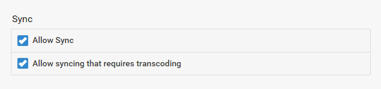

The sync feature allows you to copy content to external devices for backup purposes, archiving in multiple resolutions, and offline viewing.

## Cloud Sync

Cloud sync allows you to copy content to cloud storage accounts, for backup as well as archiving in multiple resolutions.

When content is archived in multiple resolutions, Emby apps will automatically choose the version that is most efficient for them. This will help relieve stress on your internet connection as well as your server's CPU. Apps will browse the content through your Emby Server as normal, but will stream from the cloud during playback.

Cloud Sync is currently available for:

* Drop box
* [Google Drive](Google-Drive)

Note: Cloud Sync does not move content from your local server to the cloud, nor add content from the cloud to Emby.  All media must originate and be part of the Emby Server media collection locally.

## Folder Sync

Folder sync allows you to copy content to folders and external hard drives, for backup as well as archiving in multiple resolutions. 

When content is archived in multiple resolutions, Emby apps will automatically choose the version that is most efficient for them. This will help relieve stress on your server's CPU.

For more information see [Folder Sync](Folder Sync).

## Creating Sync Jobs

See [Sync jobs](Sync-Jobs)

## User Access

Access to the sync feature can be managed individually for each user. 

For more information, see [Users](Users).