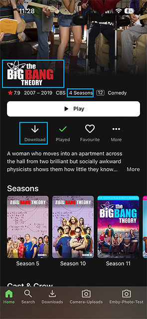
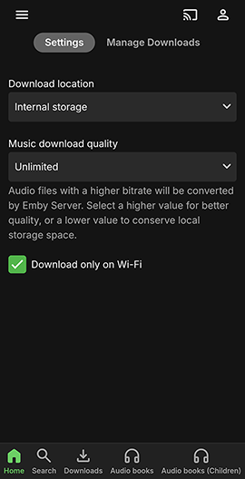
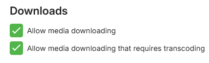

Emby client apps have a download icon and two buttons within the context menus, a **Download** button and a **Download to...** button. The latter gives the user the option to specify the target device, or if [Folder Sync](Folder-Sync.md) is configured and access to the user account is given, the target server folder to copy media to.

User access rights and previously authenticated devices for the user, would determine what the available targets for the download are. 

* The **Download** button will be shown on all Emby client apps which support downloads. 

* The **Download to** button will be shown when the user has at least one client app which supports downloads, or if the user has been granted access to a [Folder Sync](Folder-Sync.md) server folder. 

In all cases, there are options to select the quality of the download plus other options depending on the media type. 

> [!NOTE]
> The **Download** button on the [Emby Web app](Web-Client.md) is different and does not form part of the **Downloads & Sync** feature. The button, which is for single item downloads, uses the web browser functionality to download the item, without any conversion, to the default browser downloads folder. 

## Download

### Download icon

### Context Menu Download options

Context Menu for a Movie library

The **Download** button gives the same functionality as the Download icon.

Similar options are available at Season level or Episode, or movie etc.

### Download to...

The **Download to...** option allows the user to specify the target destination for the download. This is an example showing the options to download to different authenticated devices for the user.

Just about everything can be downloaded, including Genres, Collections, and Playlists, eg for a Music Genre:

This is an example for selecting the whole library from the Home screen.

And for a specific TV Show season

The following is an example of a **Download to...** menu on the [Emby Web](Web-Client.md) app showing a download target to the [Emby Theater for Windows](Emby-Theater-for-Windows.md) app.

And in the following example, the user has access to the **Folder Sync** folders that are configured.

> [!NOTE]
> When creating a download to another device or app, the [download job](Sync-Jobs.md) will initially do any requested conversion and then it will be ready to be transferred to the device. If the target Emby client app is not running, the download job will remain in this state until the app starts running and the device is accessible to the server.

## Download Settings

There are download settings for the Emby Apps and Emby Server for all downloads, as well as download settings for specific download jobs.

### Download Settings - Emby Apps

The following shows the options for the [Emby for Android](Android-Mobile.md) app. Similar options are available in the **Emby for iOS** app.

The folowing shows the options for the [Emby Theater for Windows](Emby-Theater-for-Windows.md) app.

### Download Settings - Emby Server

The following shows the options for the Emby Server that can be set in Emby Web Settings Devices / Downloads section.

### Specific Download Settings

To get started with a download, click on the available **Download** icon/button. You'll then see a dialog allowing you to select your desired download quality and on some apps, the profile for the conversion. Emby Server will convert media so that it can be downloaded in a compatible format for the device. You can choose between several quality options, as well as forcing original quality.

> [!NOTE]
> Forcing original quality may result in a download that is not playable on the device.

Custom quality allows you to set your own desired bitrate:

For TV shows, there would be additional options for restricting downloads to only unplayed episodes and for auto download of new episodes. There is also an option for setting a limit on the number to download.

On some apps, there is an option to select a profile. 

with a drop-down for the list of available download profiles:

It is also possible to use a custom profile

Clicking the **Download** button would then create a download job. See [Download Jobs](Sync-Jobs).

### Deleting Downloads

Downloaded items can be removed directly on the device within the Downloads area 

## Folder Sync

[Folder sync](Folder-Sync.md), which requires the Folder Sync plugin, allows you to copy content to folders and external hard drives, for backup as well as archiving in multiple resolutions. The actual folder syncing is achieved by creating a download job through the **Download to...** option.

When content is archived in multiple resolutions, Emby apps will automatically choose the version that is most efficient for them. This will help relieve stress on your server's CPU.

The following shows how it appears when playing an item that has a synced copy. 

For more information see [Folder Sync](Folder-Sync.md).

## Creating Download Jobs

The above showed how a download can be initiated. See [Download jobs](Sync-Jobs.md) for how to view and manage the download jobs.

## User Access

Access to the downloads feature can be managed individually for each user. 

For more information, see [Users](Users.md).

There are additional user access rights requirements for [Folder Sync](Folder-Sync.md).
