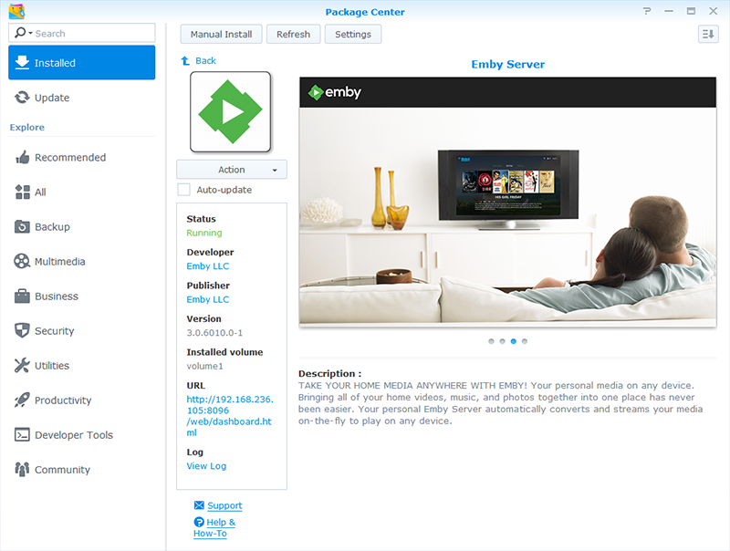

* [Summary of Models by Processor](Synology----Summary-of-Models-by-Processor)

* [Setting Up Your Media Library Share](Synology----Setting-Up-Your-Media-Library-Share)

* [A Few Important Points to Consider](Synology----A-Few-Important-Points-to-Consider)

* [How to Send us Support Logs](Synology----How-to-Send-us-Support-Logs)

* [How to Run Diagnostics](Synology----How-to-Run-Diagnostics)

* [Notes on Package Updates](Synology----Notes-on-Package-Updates)

* [Accessing Beta and Development Releases](Synology----Accessing-Beta-and-Development-Releases)

* [Migrating From the Community Package](Synology----Migrating-From-the-Community-Package)

* [Custom Package Architectures for XPEnology](Synology----Custom-Package-Architectures-for-XPEnology)
