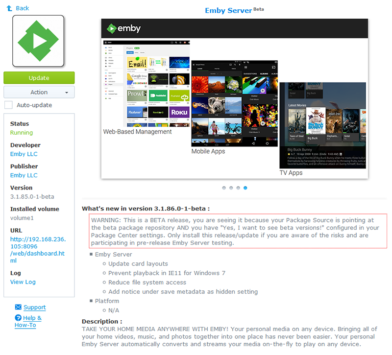

__NOTE: Only install beta versions if you are participating in the development or test communities for Emby Server, if you are a regular user stick with the stable releases! We appreciate you being a part of the test team, however we make no promises of stability if you choose to use beta releases in your production environment.__

--------

Details:-

* We currently have full Synology package support for beta releases of Emby Server, which are made available through a dedicated repository. The framework is in place to support development releases, but Mono development builds are not available at this time.

* If you want to access the beta package repository, please send me a PM @solabc16. This repository contains both stable and beta releases, to see the beta releases you will still need to tick the 'Yes, I want to see beta versions!' in Package Center's settings.

* Once you have installed a beta release, you will need to wait for a stable release with a version number that is the same or higher than the beta you have installed, before you can switch back to a stable release.

The reason for not making the beta releases via the default package source is as follows:-

`Package Center's handling of beta channels is at best limited, which has been a long standing concern with regard to introducing beta and/or dev releases of Emby Server via this mechanism. The worst scenario for us, is 'end users' (i.e. not testers or developers) accidently installing or updating to a dev or beta release and suffering a poor experience as a result.`
 
`There are many reasons why the 'beta' flag may be ticked and there are certainly some sites and package developers that require end users to do it, as they are not providing stable releases. This is not great scenario as it fails to recognise the global nature of the flag, however there is nothing we can do about that right now, so we've implemented an alternate approach.`
 
`The repository 'https://synology.emby.media/' will only serve up stable builds, regardless of the beta flag's setting. This is the URL that will be in the public domain and thus make it impossible for 'end users' to end up with a dev or beta release on their systems.`

[>> Back to Synology : Help and Support <<](https://github.com/MediaBrowser/Wiki/wiki/Synology-:-Help-and-Support)
