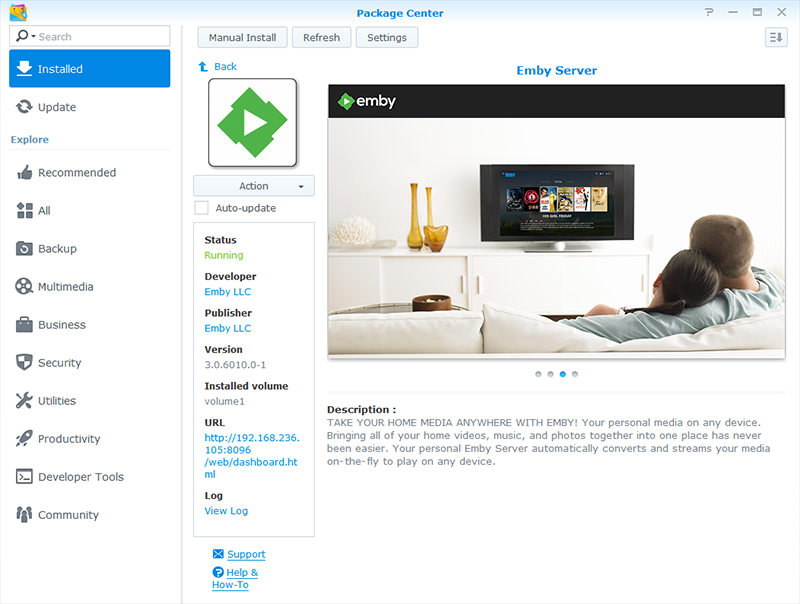

* [Summary of Models by Processor](../wiki/Synology-:-Summary-of-Models-by-Processor)

* [Setting Up Your Media Library Share](../wiki/Synology-:-Setting-Up-Your-Media-Library-Share)

* [A Few Important Points to Consider](../wiki/Synology-:-A-Few-Important-Points-to-Consider)

* [How to Send us Support Logs](../wiki/Synology-:-How-to-Send-us-Support-Logs)

* [How to Run Diagnostics](../wiki/Synology-:-How-to-Run-Diagnostics)

* [Notes on Package Updates](../wiki/Synology-:-Notes-on-Package-Updates)

* [Accessing Beta and Development Releases](../wiki/Synology-:-Accessing-Beta-and-Development-Releases)

* [Migrating From the Community Package](../wiki/Synology-:-Migrating-From-the-Community-Package)

* [Custom Package Architectures for XPEnology](../wiki/Synology-:-Custom-Package-Architectures-for-XPEnology)