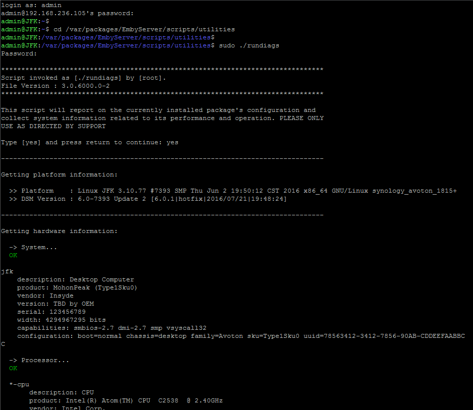

If requested by support to run diagnostics, you can do so by following this procedure:-

__DSM6__

* SSH to your Synology NAS and login as 'admin'.

* Change to utilities directory, using 'cd /var/packages/EmbyServer/scripts/utilities'.

* Run the diagnostics, using 'sudo ./rundiags'.

__DSM5__

* SSH to your Synology NAS and login as 'root'.

* Change to utilities directory, using 'cd /var/packages/EmbyServer/scripts/utilities'.

* Run the diagnostics, using './rundiags'.

__Example__

[>> Back to Synology : Help and Support <<](https://github.com/MediaBrowser/Wiki/wiki/Synology-:-Help-and-Support)
