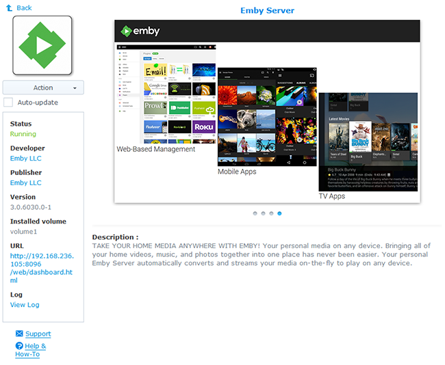
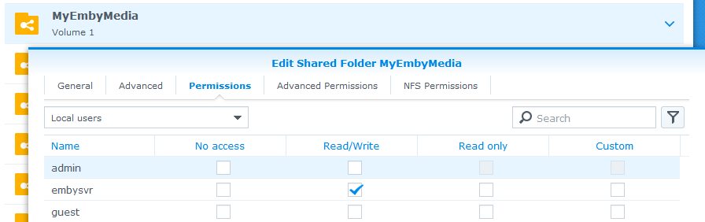
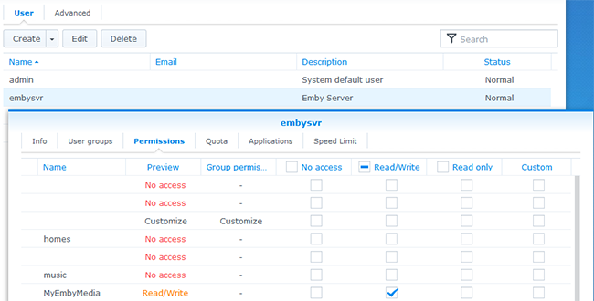
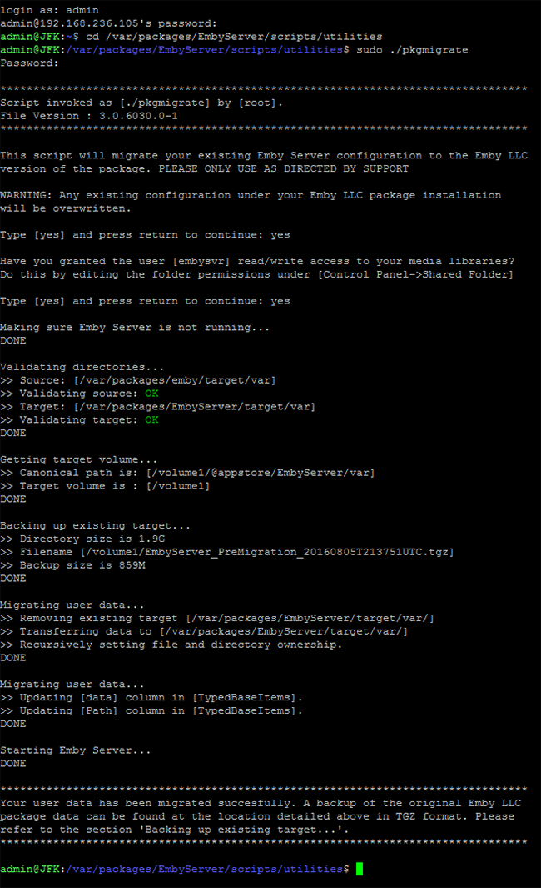

The new Emby Server package for Synology includes a migration utility, this utility allows you to transfer your settings from the community package to the new Emby supported package. The new package is entirely self contained and can be safely installed alongside the existing community package.

--------

To migrate your configuration, follow the three steps below:-

__Step 1:__ Make sure you have the Emby package for Synology successfully installed and running. You do not need to complete the initial setup wizard, but it doesn't matter if you have already done this. If you need them, the instructions for installing the package can be found under the Synology section [here](https://emby.media/nas-server.html).

__Step 2:__ The 'embysvr' user that is created as part of the package installation __must__ be granted read/write (R/W) access to the libraries you currently have configured in the community package installation of Emby Server. You can do this in DSM from a couple of places:-

_Control Panel -> Shared Folder -> 'your folder' -> Edit -> Permissions_

e.g.

_Control Panel -> User -> 'embysvr' -> Edit -> Permissions_

e.g.

__Step 3:__ Run the migration utility using the following commands...

* SSH to your Synology NAS and login as 'admin'.

* Change to utilities directory, using 'cd /var/packages/EmbyServer/scripts/utilities'.

* Run the package migration utility, using 'sudo ./pkgmigrate'.

e.g.

[>> Back to Synology : Help and Support <<](https://github.com/MediaBrowser/Wiki/wiki/Synology-:-Help-and-Support)
