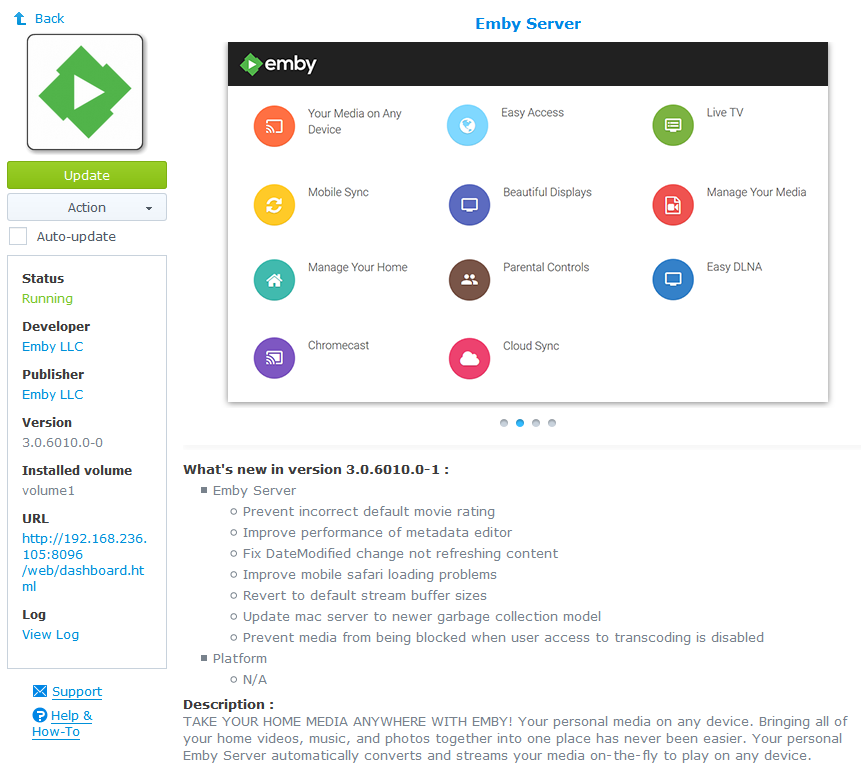
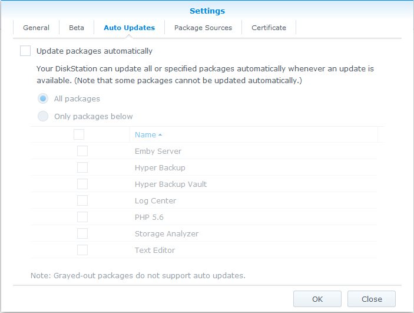
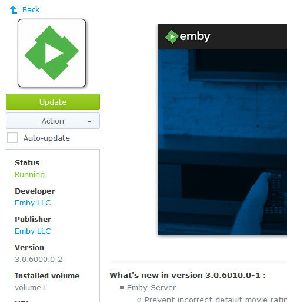

When an update to Emby Server becomes available, it will be published as an update via DSM's Package Center. All updates are fully self-contained and can be applied by simply clicking on the '_Update_' button. Details of the changes contained in the update will be displayed under the '_What's New_' section.

__NOTE :__ Updates can on occasion take a while to apply, depending on the size of your media library and/or your hardware platform. It is recommended that you apply updates at a 'quiet time', where any disruption to viewing or recording, will be kept to a minimum.

__Automatic Updates__

The Emby Server package for Synology is supported by Package Center's automatic update functionality, however we do not recommend using it.

This is for a few reasons, as given the services that Emby Server provides, it could lead to:-

* Disrupted viewing

* Missed Recordings (from Live TV)

* Partial Recordings (from Live TV)

The automatic update functionality is configured via Package Center -> Settings -> Auto Updates

Package Center will also give you the opportuntity to opt-in to automatic updates when a package update becomes available.

[>> Back to Synology : Help and Support <<](https://github.com/MediaBrowser/Wiki/wiki/Synology-:-Help-and-Support)

