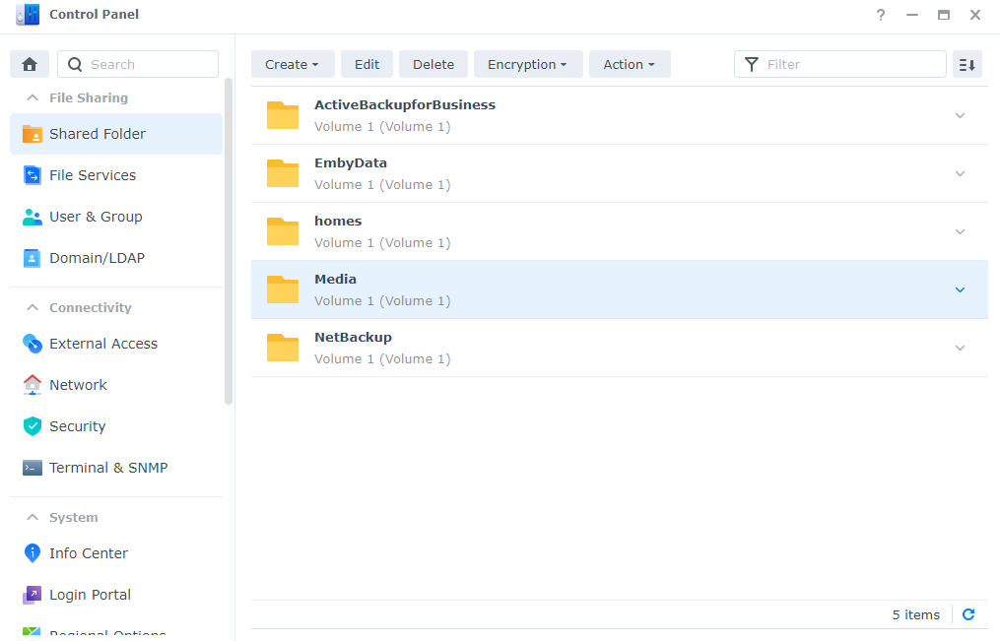
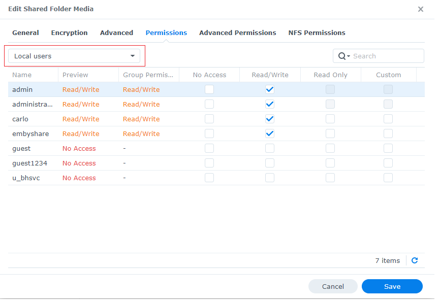
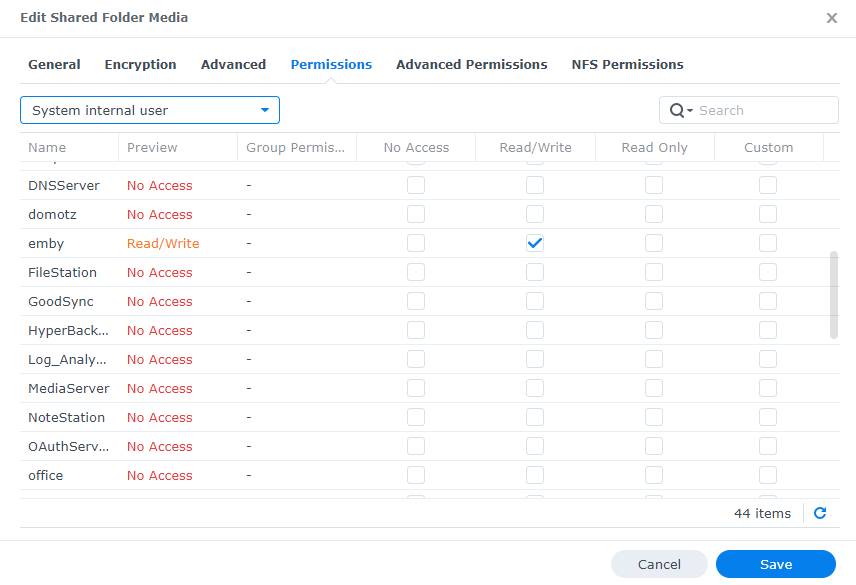

.
For Synology versions of DSM 7 and higher you need to assign read or read/write permissions to the system internal emby user for any directories used by Emby such as your media folders. We recommend setting read/write permissions to take full advantage of Emby's features.

To set permission open the Control Panel on Synology DSM.  Then open Shared Folders.  
Highlight the shared folder containing the media you wish to appear in Emby.

Click Edit, then select the Permissions tab:

Change the drop down user type to "System internal user" (in the red box above).
Scroll down if needed until you see the emby user.
Check the column to give emby at least Read Only access but we suggest granting Read/Write access like this:

Click the Save button.
Repeat this process for any other shares containing media for Emby.
Emby Server should now be able to access the folders.