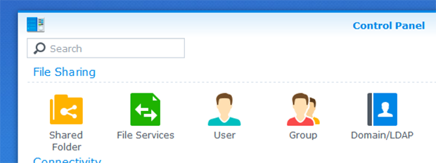
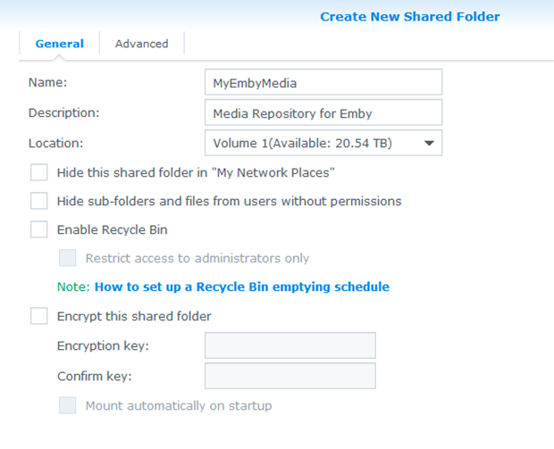
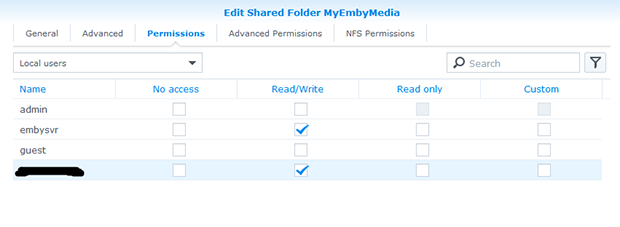
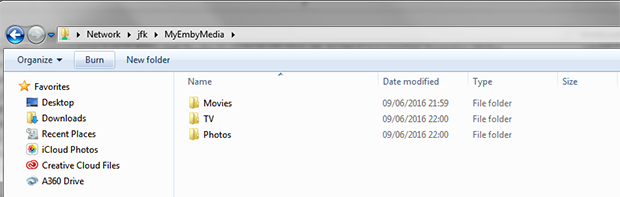
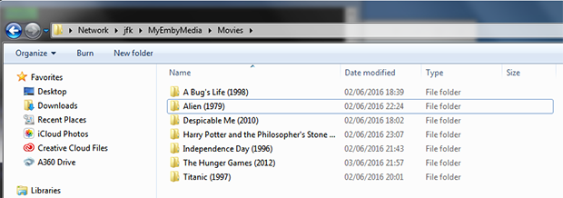
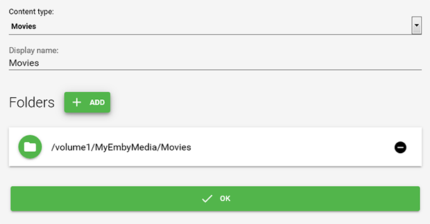
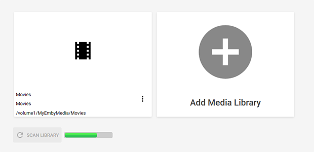
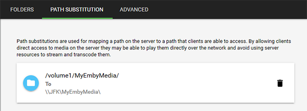
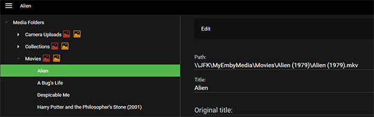
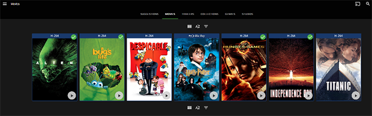

The media library is a key component of your Emby Server setup, the following is a step-by-step guide for a reference setup.

_However you decide to setup your library, making sure Emby Server has read/write access to it, is critical._

__NOTE__: The name of the NAS in this example is JFK, substitute with the name of your system accordingly.

--------

__Step 1 :__ Navigate to Control Panel -> Shared Folder. _(shared folders are assumed, as you'll need a way to upload your media)_

__Step 2 :__ Set the Name, Description and choose a Location. _(if you have more than one volume available)_

__Step 3 :__ Grant the Emby Server user Read/Write access, along with any other users you wish to have access to upload media.

__Step 4 :__ Navigate to the share from your desktop machine and create sub-directories for Movies, TV, etc. _(in this case we're doing it from a Windows based machine)_

__Step 5 :__ Upload your media to the shared folder.

__Step 6 :__ In the Emby server manager navigate to Library -> Add Media Library to configure the media sources. (example below shows adding movies)

__Step 7 :__ Once complete, the media library will be added and you will see Emby make an initial scan.

__Step 8 :__ Configure path substitution to enable clients to direct play media, pay attention to the trailing slashes!

__Step 9 :__ You should now be able to browse your media in Metadata Manager, you can also confirm that path substitution is working as expected.

__Step 10 :__ The end result, your media displayed in the client application and ready to go. _(in this case the Web UI, with CoverArt applied)_

[>> Back to Synology : Help and Support <<](https://github.com/MediaBrowser/Wiki/wiki/Synology-:-Help-and-Support)
