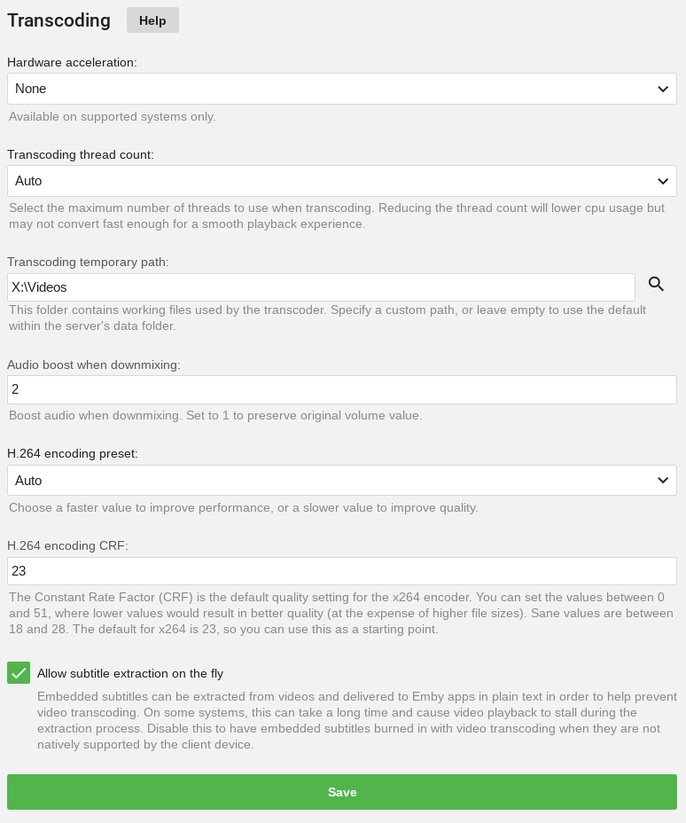
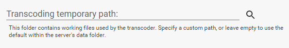
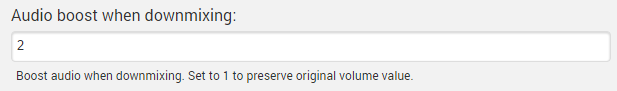
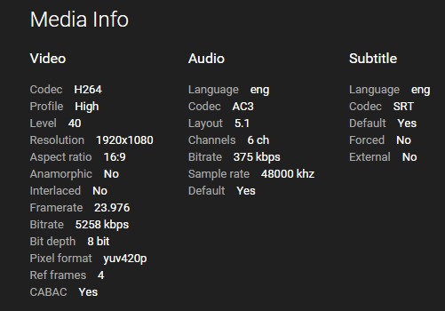

Emby has the ability to convert your media during playback in order to make it compatible with all of your devices. This process is known as transcoding.

In most cases, the server and the apps will automatically select the ideal settings to achieve smooth playback. This is based on a variety of factors including network performance, media information, device capabilities, and various configuration settings. In some cases though, you may choose to provide your own configuration in order to improve the playback experience.

## App Settings

Every Emby app will have a setting known as "Max streaming bitrate". This is the most important setting to configure within the app that you're trying to use, and will have the greatest effect on image quality. As you increase the bitrate quality will improve, but will require a faster connection between the device and server.

**Ineligible formats for transcode**
* [Dvd and Blu-ray](Movie-naming#dvd-and-blu-ray)
* [ISOs](Movie-naming#isos)
* [3D videos](Movie-naming#3d-videos)

# Server Settings

In addition, the server has some transcoding settings that can be configured. These are found by opening the server dashboard and navigating to **Transcoding**.

The **hardware video decoder setting** allows the use of the following options:

* Intel Quick Sync
* NVidia NVENC
* Open MAX (OMX)
* VAAPI

NB. This is not an exhaustive list, so please choose the correct setting in the drop-down menu.

This should only be enabled if you have the appropriate hardware and may result in errors otherwise. If you're unsure, leave the setting at Auto and the system will attempt to automatically detect this.

The **thread count setting** allows you to specify how many processors to allocate to each transcoding job. In almost all cases, this should be left to Auto as the system will adapt based on current conditions.

## Temporary Path

The server will need to create temporary files throughout the transcoding process. The location of these files can be configured.

If you specify a custom path, please ensure the following conditions are met:

* The folder is writable
* The folder is not used for any other purpose, as the server will delete all contents to keep it clean.

## Audio Boost

When surround audio is converted to 2-channel stereo audio, this often results in a lower volume level. To offset this, you can configure an audio boost scale factor to increase the volume.

The default value is **2**, meaning the volume will be doubled when converting surround audio to stereo.

## Why Is My Media Transcoding?

Whenever possible, Emby apps will play your files directly and avoid transcoding. Transcoding will only be used when files are not natively supported by the device you're trying to play from, or the bitrate of the content is higher than the app's bitrate setting.

**Why Is My File Transcoding?**

* First, compare the media format of your file to the format supported by the Emby app. You can find the media info in the Emby Web Client, at the bottom of the detail page:

If the file is not natively supported, transcoding will be required.

* Next, compare the bitrate of your file to the bitrate setting in the app. You can find the bitrate of your file by checking the media info in the web interface. If the bitrate of the file is higher than the setting in the app, transcoding will be required. Increasing the bitrate setting in the app can help reduce transcoding, but may impact playback performance if your network connection is not fast enough to handle it. Emby apps are beginning to support automatic bitrate detection in order to automatically select the highest bitrate possible. Most users will see best results by leaving the bitrate setting on Auto.

* Lastly, are subtitles selected? If subtitles are selected, then this may trigger transcoding if the app does not natively support the subtitle format. Most Emby apps have native support for text-based subtitles (e.g. srt, vtt, etc). Graphical subtitles such as PGS and VobSub are more likely to trigger transcoding.

To learn more about the formats that are natively supported by each Emby app, please visit the wiki section for that app:

* [Amazon Fire TV](Fire-TV)
* [Android Mobile](Android-Mobile)
* [Android TV](Android-TV)
* [Chromecast](Chromecast)
* [iOS](iOS)
* [Roku](Roku)
* [Web Client](Web-Client)

## My Files Shouldn't Be Transcoding. How Do I Report This?

Start by focusing on a single example. Please report this in our community:

http://emby.media/community/

Please make sure to supply the following information:

* A copy of the media info from the web interface
* The Emby Server log from the time you played the content
* The Emby Server transcoding logs from the same time (if any).

Logs can be accessed directly within the server's web interface by navigating to **Help** -> **Logs**.