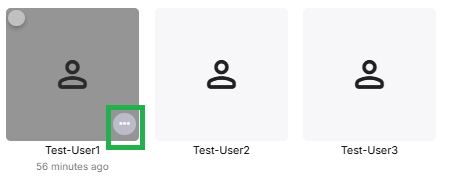
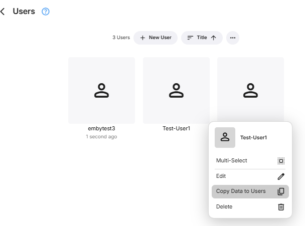
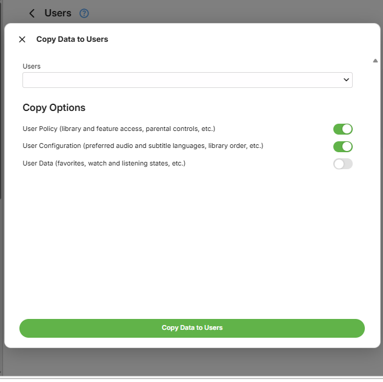
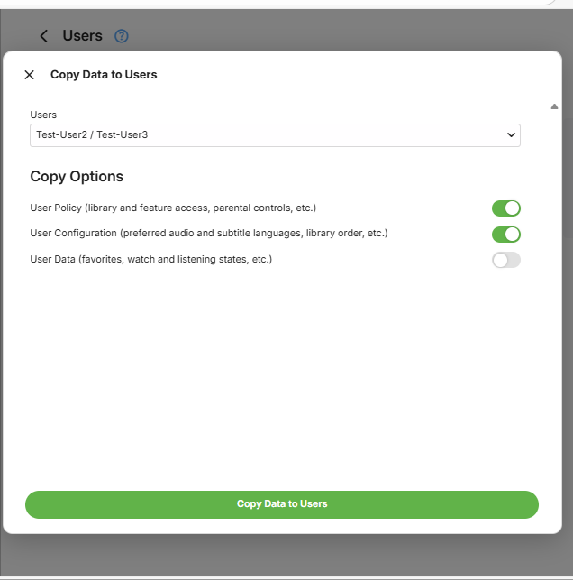

The Emby Server administrator has access through the server dashboard Users administration pages, top replicate the customization for a given Emby user account to one or more other user accounts.

In the example below, we are to copy the settings from **Test-User1** to **Test-User2** and **Test-User3**.

Select **Users** from the server dashboard and then locate the user to copy the data from and click on the **...**

You will see an option to copy data in the pop-up box

Clicking on **Copy Data to Users** will show the **Copy Options** available and a drop-down for the Users to select as target to copy to. **Take extra care when selecting users to copy the settings to.**

In this example, I have ticked **Test-User2** and **Test-User3** as the target users to copy **Test-User1** settings and preferences to.

